### 📚 Detailed Explanation

#### 📦 Process
-   **Process ante entidi?** Program in execution is called a Process. Ante, nuvvu `chrome.exe` or `spotify.exe` click chesinapudu, operating system daaniki kontha memory (RAM) and CPU time isthundi. Aa running instance eh `Process`.
-   **Key Properties:**
    -   **Heavyweight:** Process create cheyadam anedi konchem ekkuva time and resource aithadi.
    -   **Isolated Memory:** Prathi process ki daani sonta memory area (address space) untadi. Oka process (Chrome) inkoka process (Spotify) memory ni direct ga access cheyaldu. 🛡️ Idi security ki chala manchidi.
    -   **Inter-Process Communication (IPC):** Rendu processes matladukovali ante, adi konchem complicated. Daani kosam special mechanisms (like files, sockets, pipes) vaadali.

#### 🧵 Thread
-   **Thread ante entidi?** Thread is a lightweight sub-process. Idi oka process lo unde oka separate path of execution. Okate process lo multiple threads undochu.
-   **Key Properties:**
    -   **Lightweight:** Thread create cheyadam chala fast and takkuva resources tisukuntadi (process tho compare cheste).
    -   **Shared Memory:** Okate process lo unna threads anni aa process memory ni share cheskuntai. 💾 Ante, oka thread create chesina object ni, inkoka thread chudagaladhu and modify cheyagaladhu. Idhe communication ni chala easy chestundi, but deeni valla konni problems kuda vastai (Race Conditions - 📌 *mana next topics lo detailed ga cover chestam bro*).
    -   **Context Switching:** Threads madhya switch avvadam chala fast ga aipotundi, endukante memory share cheskuntaru kabatti.

### 🧠 Mental Model Diagram

```mermaid
graph TD
    subgraph Process 1 (e.g., Chrome Browser)
        direction LR
        A[Memory Space: RAM]
        T1[Thread 1: YouTube Tab]
        T2[Thread 2: Gmail Tab]
        T3[Thread 3: Background Download]

        A --- T1
        A --- T2
        A --- T3
    end

    subgraph Process 2 (e.g., Spotify)
        direction LR
        B[Memory Space: RAM]
        S1[Thread 1: Playing Music]
        S2[Thread 2: UI Rendering]

        B --- S1
        B --- S2
    end

    style Process 1 fill:#c7ecee
    style Process 2 fill:#dff9fb
```
**Explanation:** Diagram lo chudu mawa, Chrome (Process 1) ki daani sonta memory undi. Andulo unna 3 threads (YouTube, Gmail, Download) aa memory ni share cheskuntunnai. Alage Spotify (Process 2) ki kuda separate memory undi. Chrome threads, Spotify memory ni access cheyalevu.

### 📊 Comparison Table: Process vs Thread

| Feature             | Process (Heavyweight) 🏋️‍♂️                                    | Thread (Lightweight) 🏃‍♂️                                  |
| ------------------- | ----------------------------------------------------------- | -------------------------------------------------------- |
| **Weight**          | Heavyweight                                                 | Lightweight                                              |
| **Memory**          | Separate memory space for each process. (Isolated)          | Shared memory space within the same process.             |
| **Creation Time**   | Slow (takes more time)                                      | Fast (takes less time)                                   |
| **Context Switch**  | Slow (OS has to save and load a lot of data)                | Fast (only needs to save registers and stack)            |
| **Communication**   | Complex (needs IPC mechanisms like sockets, files)          | Easy (can directly share objects and variables)          |
| **Fault Isolation** | High. Oka process crash aithe, inkoti safe ga untadi. ✅     | Low. Oka thread crash aithe, entire process crash avvochu. ❌ |
| **Example**         | Running Chrome and VS Code at the same time.                | In Chrome, one tab loading a page, another playing a video. |

---
---

### 🤔 What & Why: Concurrency vs Parallelism

**Problem Statement:**
Multithreading ante multiple threads use cheyadam ani ardamaindi. But, ee threads anni nijanga okate sari (at the same exact moment) run autaya? Leda okadani tarvata okati chala fast ga switch autaya? Deeni gurinchi clear ga telusukovali.

**Solution:**
Ee doubt ni clear cheyadaniki manaki **Concurrency** and **Parallelism** ane rendu concepts unnai. Rendu "doing multiple things" gurinche matladutai, kaani chala a subtle difference undi. 🔥

**Real-World Analogy: 🏠 A Single Chef vs Multiple Chefs**

-   **Concurrency (ఒక చెఫ్ - పనులు మార్చుకోవడం):**
    Imagine kitchen lo **okate chef** unnadu. Atanu multiple panulu cheyali - rice cook cheyali, curry cut cheyali, salad prepare cheyali.
    -   Chef konchem rice petti, stove meeda petti vellipotadu.
    -   Aa time lo curry kosam vegetables cut cheyadam start chestadu.
    -   Madhaylo rice check chesi, malli curry cutting ki vastadu.
    Idhi **Concurrency**. Chef okate, but panula madhya fast ga switch avvadam valla anni panulu progress autunnai. Okate time lo anni panulu cheyatledu, but anni panulu complete autunnai. **It's about dealing with a lot of things at once.**

-   **Parallelism (చాలా మంది చెఫ్‌లు - పనులు పంచుకోవడం):**
    Imagine aa kitchen lo **multiple chefs (naluguru)** unnaru and **multiple stoves** unnai.
    -   Chef 1 full time rice mida focus chestadu.
    -   Chef 2 full time curry mida focus chestadu.
    -   Chef 3 full time salad prepare chestadu.
    Idhi **Parallelism**. Multiple panulu **literally at the same time** jarugutunnai, endukante multiple resources (chefs, stoves) unnai kabatti. **It's about doing a lot of things at once.**

### 📚 Detailed Explanation

#### ⚡ Concurrency
-   **Concurrency ante entidi?** It is the task of running and managing multiple tasks at the same time. Single core CPU lo kuda manam concurrency achieve cheyochu.
-   **Ela work aithadi?** Operating system chala fast ga threads madhya switch (context switching) chestundi. Mana brain ki adi antha fast ga jaragadam valla, anni panulu okate sari jarugutunnai ane illusion create aithundi.
-   **Goal:** To improve the responsiveness of the application. Example: Nuvvu button click chesinapudu UI hang avvakunda, background lo download jaragali.

#### 🚀 Parallelism
-   **Parallelism ante entidi?** It is the task of running multiple tasks simultaneously. Idi achieve cheyalante **multi-core processor** anedi compulsory.
-   **Ela work aithadi?** Prathi core mida oka thread/task simultaneously run aithundi. Nalugu cores unte, nalugu panulu okate sari run avvochu.
-   **Goal:** To improve the performance and speed of the application. Example: Oka pedda video ni encode cheyadaniki, daani parts ni multiple cores mida parallel ga process cheyadam.

### 🧠 Mental Model Diagram


```mermaid
gantt
    title Concurrency on Single Core CPU
    dateFormat  X
    axisFormat %S

    section Tasks
    Task A      : 0, 2
    Task B      : 2, 2
    Task A      : 4, 1
    Task C      : 5, 2
    Task B      : 7, 2


    title Parallelism on Multi-Core CPU
    dateFormat  X
    axisFormat %S

    section Core 1
    Task A      : 0, 5

    section Core 2
    Task B      : 0, 6

    section Core 3
    Task C      : 0, 4

```

**Explanation:**
-   **Concurrency Diagram:** Chudu mawa, okate CPU time line undi. Task A, B, C madhya CPU fast ga switch avtundi. Okate time lo okate task run avtundi.
-   **Parallelism Diagram:** Ikkada 3 cores unnai, so 3 tasks (A, B, C) literally at the same time run avtunnai.

### 📊 Comparison Table: Concurrency vs Parallelism

| Feature             | Concurrency (Juggling tasks) 🤹‍♀️                            | Parallelism (Executing simultaneously)  parallelism 🚴‍♂️🚴‍♂️🚴‍♂️ |
| ------------------- | ----------------------------------------------------------- | ----------------------------------------------------- |
| **CPU Cores**       | Can be achieved on a single-core CPU.                       | Requires a multi-core CPU.                            |
| **Execution**       | Tasks progress by switching between them (interleaving).    | Tasks run simultaneously.                             |
| **Goal**            | To make the application more responsive. (e.g., UI doesn't freeze) | To make the application faster. (e.g., faster computation) |
| **How it works**    | Context Switching.                                          | Multiple CPUs executing code.                         |
| **Analogy**         | One person juggling multiple balls.                         | Multiple people catching their own ball.              |
| **Example**         | A web server handling multiple client requests with one CPU. | A video editor rendering multiple frames on different cores. |

---

### ✨ Key Takeaways (Top 5)
1.  **Process vs Thread:** Process ante oka running application (like Chrome), Thread ante aa process lo jarige oka chinna pani (like a Chrome tab). 💪
2.  **Memory:** Processes ki separate memory untadi. Threads (of the same process) memory ni share cheskuntai. 💾
3.  **Lightweight/Heavyweight:** Threads are lightweight, Processes are heavyweight. Create cheyadam, switch cheyadam threads lo fast ga untadi. 🚀
4.  **Concurrency:** Panula madhya fast ga switch avvadam. Single core lo kuda possible. Goal is **responsiveness**. 🤹‍♀️
5.  **Parallelism:** Panulani okate sari run cheyadam. Multi-core processor compulsory. Goal is **performance**. 🚴‍♂️🚴‍♂️

### ➡️ Next Step
Baga nerchukunnam ra! 🎉 Ee core concepts (Process, Thread, Concurrency, Parallelism) ippudu clear ga unnai anukuntunna. Tarvata manam **"1.2 Creating & Managing Threads in Java"** ki veldam. Ippudu ee foundation tho, actual ga Java lo threads ni ela create cheyalo, ela manage cheyalo chuddam! 🔥
