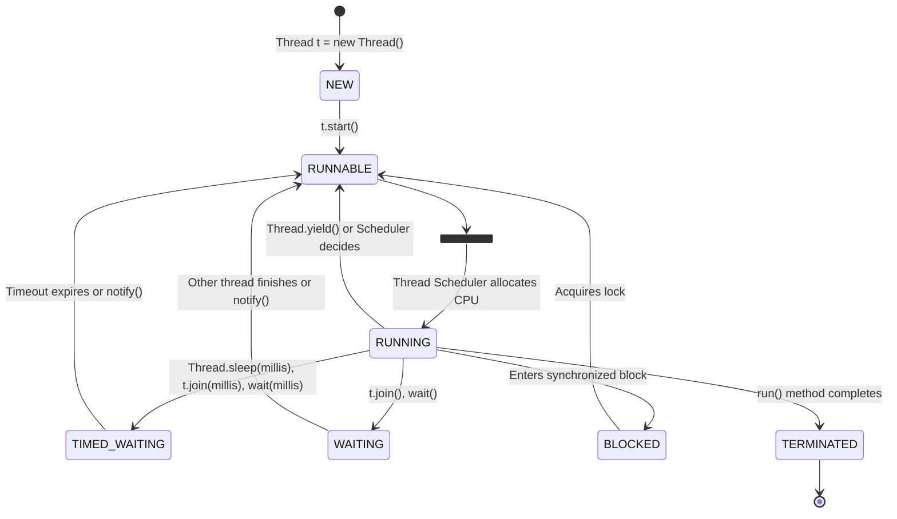

### 📚 Detailed Explanation

#### 📦 Process
-   **Process ante entidi?** Program in execution is called a Process. Ante, nuvvu `chrome.exe` or `spotify.exe` click chesinapudu, operating system daaniki kontha memory (RAM) and CPU time isthundi. Aa running instance eh `Process`.
-   **Key Properties:**
    -   **Heavyweight:** Process create cheyadam anedi konchem ekkuva time and resource aithadi.
    -   **Isolated Memory:** Prathi process ki daani sonta memory area (address space) untadi. Oka process (Chrome) inkoka process (Spotify) memory ni direct ga access cheyaldu. 🛡️ Idi security ki chala manchidi.
    -   **Inter-Process Communication (IPC):** Rendu processes matladukovali ante, adi konchem complicated. Daani kosam special mechanisms (like files, sockets, pipes) vaadali.

#### 🧵 Thread
-   **Thread ante entidi?** Thread is a lightweight sub-process. Idi oka process lo unde oka separate path of execution. Okate process lo multiple threads undochu.
-   **Key Properties:**
    -   **Lightweight:** Thread create cheyadam chala fast and takkuva resources tisukuntadi (process tho compare cheste).
    -   **Shared Memory:** Okate process lo unna threads anni aa process memory ni share cheskuntai. 💾 Ante, oka thread create chesina object ni, inkoka thread chudagaladhu and modify cheyagaladhu. Idhe communication ni chala easy chestundi, but deeni valla konni problems kuda vastai (Race Conditions - 📌 *mana next topics lo detailed ga cover chestam bro*).
    -   **Context Switching:** Threads madhya switch avvadam chala fast ga aipotundi, endukante memory share cheskuntaru kabatti.

### 🧠 Mental Model Diagram

```mermaid
graph TD
    subgraph Process 1 (e.g., Chrome Browser)
        direction LR
        A[Memory Space: RAM]
        T1[Thread 1: YouTube Tab]
        T2[Thread 2: Gmail Tab]
        T3[Thread 3: Background Download]

        A --- T1
        A --- T2
        A --- T3
    end

    subgraph Process 2 (e.g., Spotify)
        direction LR
        B[Memory Space: RAM]
        S1[Thread 1: Playing Music]
        S2[Thread 2: UI Rendering]

        B --- S1
        B --- S2
    end

    style Process 1 fill:#c7ecee
    style Process 2 fill:#dff9fb
```
**Explanation:** Diagram lo chudu mawa, Chrome (Process 1) ki daani sonta memory undi. Andulo unna 3 threads (YouTube, Gmail, Download) aa memory ni share cheskuntunnai. Alage Spotify (Process 2) ki kuda separate memory undi. Chrome threads, Spotify memory ni access cheyalevu.

### 📊 Comparison Table: Process vs Thread

| Feature             | Process (Heavyweight) 🏋️‍♂️                                    | Thread (Lightweight) 🏃‍♂️                                  |
| ------------------- | ----------------------------------------------------------- | -------------------------------------------------------- |
| **Weight**          | Heavyweight                                                 | Lightweight                                              |
| **Memory**          | Separate memory space for each process. (Isolated)          | Shared memory space within the same process.             |
| **Creation Time**   | Slow (takes more time)                                      | Fast (takes less time)                                   |
| **Context Switch**  | Slow (OS has to save and load a lot of data)                | Fast (only needs to save registers and stack)            |
| **Communication**   | Complex (needs IPC mechanisms like sockets, files)          | Easy (can directly share objects and variables)          |
| **Fault Isolation** | High. Oka process crash aithe, inkoti safe ga untadi. ✅     | Low. Oka thread crash aithe, entire process crash avvochu. ❌ |
| **Example**         | Running Chrome and VS Code at the same time.                | In Chrome, one tab loading a page, another playing a video. |

---
---

### 🤔 What & Why: Concurrency vs Parallelism

**Problem Statement:**
Multithreading ante multiple threads use cheyadam ani ardamaindi. But, ee threads anni nijanga okate sari (at the same exact moment) run autaya? Leda okadani tarvata okati chala fast ga switch autaya? Deeni gurinchi clear ga telusukovali.

**Solution:**
Ee doubt ni clear cheyadaniki manaki **Concurrency** and **Parallelism** ane rendu concepts unnai. Rendu "doing multiple things" gurinche matladutai, kaani chala a subtle difference undi. 🔥

**Real-World Analogy: 🏠 A Single Chef vs Multiple Chefs**

-   **Concurrency (ఒక చెఫ్ - పనులు మార్చుకోవడం):**
    Imagine kitchen lo **okate chef** unnadu. Atanu multiple panulu cheyali - rice cook cheyali, curry cut cheyali, salad prepare cheyali.
    -   Chef konchem rice petti, stove meeda petti vellipotadu.
    -   Aa time lo curry kosam vegetables cut cheyadam start chestadu.
    -   Madhaylo rice check chesi, malli curry cutting ki vastadu.
    Idhi **Concurrency**. Chef okate, but panula madhya fast ga switch avvadam valla anni panulu progress autunnai. Okate time lo anni panulu cheyatledu, but anni panulu complete autunnai. **It's about dealing with a lot of things at once.**

-   **Parallelism (చాలా మంది చెఫ్‌లు - పనులు పంచుకోవడం):**
    Imagine aa kitchen lo **multiple chefs (naluguru)** unnaru and **multiple stoves** unnai.
    -   Chef 1 full time rice mida focus chestadu.
    -   Chef 2 full time curry mida focus chestadu.
    -   Chef 3 full time salad prepare chestadu.
    Idhi **Parallelism**. Multiple panulu **literally at the same time** jarugutunnai, endukante multiple resources (chefs, stoves) unnai kabatti. **It's about doing a lot of things at once.**

### 📚 Detailed Explanation

#### ⚡ Concurrency
-   **Concurrency ante entidi?** It is the task of running and managing multiple tasks at the same time. Single core CPU lo kuda manam concurrency achieve cheyochu.
-   **Ela work aithadi?** Operating system chala fast ga threads madhya switch (context switching) chestundi. Mana brain ki adi antha fast ga jaragadam valla, anni panulu okate sari jarugutunnai ane illusion create aithundi.
-   **Goal:** To improve the responsiveness of the application. Example: Nuvvu button click chesinapudu UI hang avvakunda, background lo download jaragali.

#### 🚀 Parallelism
-   **Parallelism ante entidi?** It is the task of running multiple tasks simultaneously. Idi achieve cheyalante **multi-core processor** anedi compulsory.
-   **Ela work aithadi?** Prathi core mida oka thread/task simultaneously run aithundi. Nalugu cores unte, nalugu panulu okate sari run avvochu.
-   **Goal:** To improve the performance and speed of the application. Example: Oka pedda video ni encode cheyadaniki, daani parts ni multiple cores mida parallel ga process cheyadam.

### 🧠 Mental Model Diagram


**Explanation:**
-   **Concurrency Diagram:** Chudu mawa, okate CPU time line undi. Task A, B, C madhya CPU fast ga switch avtundi. Okate time lo okate task run avtundi.
-   **Parallelism Diagram:** Ikkada 3 cores unnai, so 3 tasks (A, B, C) literally at the same time run avtunnai.

### 📊 Comparison Table: Concurrency vs Parallelism

| Feature             | Concurrency (Juggling tasks) 🤹‍♀️                            | Parallelism (Executing simultaneously)  parallelism 🚴‍♂️🚴‍♂️🚴‍♂️ |
| ------------------- | ----------------------------------------------------------- | ----------------------------------------------------- |
| **CPU Cores**       | Can be achieved on a single-core CPU.                       | Requires a multi-core CPU.                            |
| **Execution**       | Tasks progress by switching between them (interleaving).    | Tasks run simultaneously.                             |
| **Goal**            | To make the application more responsive. (e.g., UI doesn't freeze) | To make the application faster. (e.g., faster computation) |
| **How it works**    | Context Switching.                                          | Multiple CPUs executing code.                         |
| **Analogy**         | One person juggling multiple balls.                         | Multiple people catching their own ball.              |
| **Example**         | A web server handling multiple client requests with one CPU. | A video editor rendering multiple frames on different cores. |

---

### ✨ Key Takeaways (Top 5)
1.  **Process vs Thread:** Process ante oka running application (like Chrome), Thread ante aa process lo jarige oka chinna pani (like a Chrome tab). 💪
2.  **Memory:** Processes ki separate memory untadi. Threads (of the same process) memory ni share cheskuntai. 💾
3.  **Lightweight/Heavyweight:** Threads are lightweight, Processes are heavyweight. Create cheyadam, switch cheyadam threads lo fast ga untadi. 🚀
4.  **Concurrency:** Panula madhya fast ga switch avvadam. Single core lo kuda possible. Goal is **responsiveness**. 🤹‍♀️
5.  **Parallelism:** Panulani okate sari run cheyadam. Multi-core processor compulsory. Goal is **performance**. 🚴‍♂️🚴‍♂️

### ➡️ Next Step
Baga nerchukunnam ra! 🎉 Ee core concepts (Process, Thread, Concurrency, Parallelism) ippudu clear ga unnai anukuntunna. Tarvata manam **"1.2 Creating & Managing Threads in Java"** ki veldam. Ippudu ee foundation tho, actual ga Java lo threads ni ela create cheyalo, ela manage cheyalo chuddam! 🔥

---
---

## 🏗️ JVM Thread Architecture & Java Memory Model (JMM)

**Problem Statement:**
Manam mundu `Thread` anedi `Process` yokka memory ni share cheskuntundi ani cheppukunnam. But, aa memory ela organize cheyabaddadi? Prathi thread ki sonta memory emaina untada? Rendu threads okate variable ni access cheste emavutundi? Ee questions ki answer JVM architecture lo undi.

**Solution:**
JVM prathi application kosam oka memory area ni reserve chestundi. Ee memory area rendu main parts ga divide cheyabaddadi:
1.  **Heap Memory:** Idi antha application ki okate untadi. Anni threads ee memory ni share cheskuntai. Manam `new` keyword tho create chese anni objects ikkade store avutai.
2.  **Thread Stack:** Prathi thread ki sonta (private) stack memory untadi. Ee memory ni vere threads chudaleyavu. Deentlo aa thread execute chese methods, local variables, and method call information store avutai.

**Real-World Analogy: 🏢 A Library**

-   **Heap Memory (Main Library Hall):** Library lo unna main hall anukondi. Andulo unna books anni (`Objects`) andariki (anni `Threads` ki) accessible. Evaraina vachi aa books ni teskovachu, chadavachu.
-   **Thread Stack (Personal Study Desk):** Prathi person (Thread) ki oka personal study desk untadi. Vallu aa desk meeda వాళ్ళ sonta notes (`local variables`), current chadvutunna book (`method call`) pettukuntaru. Ee desk private; pakkana unna person direct ga vachi nee desk lo chudaru.

---

### 🧠 Mental Model Diagram: JVM Memory

```mermaid
graph TD
    subgraph JVM Memory
        subgraph Shared Between All Threads
            Heap_Memory[Heap Memory <br> (All Objects Live Here)]
            Method_Area[Method Area <br> (Class Level Data, Static Variables)]
        end

        subgraph Thread-1 Private Memory
            T1_Stack[Thread-1 Stack <br> (Local Variables, Method Calls)]
            T1_PC[PC Registers]
        end

        subgraph Thread-2 Private Memory
            T2_Stack[Thread-2 Stack <br> (Local Variables, Method Calls)]
            T2_PC[PC Registers]
        end

        T1_Stack -- Interacts with --> Heap_Memory
        T2_Stack -- Interacts with --> Heap_Memory
    end

    style Heap_Memory fill:#c7ecee
    style Method_Area fill:#c7ecee
    style T1_Stack fill:#ffeaa7
    style T2_Stack fill:#ffeaa7
```

**Explanation:**
-   **Heap & Method Area:** Ee rendu areas anni threads madhya common. `Thread-1` create chesina `new User()` object ni `Thread-2` kuda access cheyagaladu, endukante adi Heap lo untadi.
-   **Thread Stack:** Prathi thread ki sonta stack untadi. `Thread-1` lo unna `int x = 10;` (local variable) anedi `Thread-2` ki kanipinchadu.
-   **PC Registers:** Prathi thread ki oka Program Counter (PC) register untadi. Idi next ഏ instruction execute cheyalo track chestundi.

---

### 🔥 The Java Memory Model (JMM)

JMM anedi oka abstract concept. Idi Java threads, memory tho ela interact avtayo cheppe rules and guarantees set. Main ga idi **Visibility** and **Ordering** problems ni solve cheyadaniki try chestundi.

-   **Problem 1: Visibility:**
    Oka core (CPU-1) mida run ayye `Thread-1`, `sharedVariable = 10` ani set chesindi anukundam. Inko core (CPU-2) mida run ayye `Thread-2` aa `sharedVariable` ni chuste, daaniki `10` kanipinchali kada? Kaani, performance kosam, prathi core ki sonta cache untadi. `Thread-1` chesina change, daani cache lo undi, main memory (RAM) ki vellakapovachu. So, `Thread-2` ki inka old value (e.g., `0`) kanipinchachu. **This is a visibility problem.**

-   **Problem 2: Instruction Reordering:**
    Performance kosam, compiler and CPU, manam rasina code order ni marchaesi, vere order lo execute cheyochu. Single thread lo idi problem kaadu, but multi-threaded environment lo idi pedda a disaster avvochu.

**JMM Solution:**
JMM ee problems ni solve cheyadaniki `synchronized`, `volatile`, and `final` lanti keywords use chesi konni guarantees (happens-before relationship) isthundi.

📌 **Coming Up:** JMM, Visibility, Reordering, `volatile` and `synchronized` gurinchi manam **Phase 2** lo chala detailed ga matladukuntam. Ippatiki, prathi thread ki sonta stack and anni threads ki common heap untadi anedi gurthupettukunte chalu.

---
---

## 🚦 Thread Lifecycle & States

Oka thread anedi create ayyinappati nunchi, adi complete ayye varaku, chala different states (stithulu) lo untundi. Ee states ni ardham cheskovadam, debugging ki chala help avutundi.

**Analogy: 👶 A Person's Life**
-   **NEW:** Just born baby (puttadam).
-   **RUNNABLE:** School ki velladaniki ready ga unna student (pani cheyadaniki ready).
-   **RUNNING:** Office lo pani chestunna employee (actually doing work).
-   **BLOCKED/WAITING:** Bus kosam waiting, or doctor appointment kosam waiting (verey vaalla kosam aagadam).
-   **TERMINATED:** Life cycle complete (chanipovadam).

---

### 🧠 Mental Model Diagram: Thread States



### 📚 Detailed Explanation of States

1.  **`NEW`**
    -   **Entidi:** Thread object create aindi, kaani inka `start()` method call cheyaledu.
    -   **Analogy:** Car tayaru aindi, kaani inka engine start cheyaledu.
    -   **Code:** `Thread t = new Thread(myRunnable);`

2.  **`RUNNABLE`**
    -   **Entidi:** `start()` method call chesaka, thread ee state ki vastundi. Idi ante, thread pani cheyadaniki ready ga undi, kaani thread scheduler inka deeniki CPU time ivvaledu.
    -   **Analogy:** Race start aindi, runner start line daggara ready ga unnadu, whistle kosam waiting.
    -   **Code:** `t.start();`

3.  **`RUNNING`**
    -   **Entidi:** Idi `RUNNABLE` state lo oka sub-state anukovachu. Thread scheduler CPU ni ee thread ki assign chesinapudu, adi `run()` method lo unna code ni execute cheyadam start chestundi.
    -   **Note:** Java Thread API lo `RUNNING` ane separate state ledu. `RUNNABLE` lone idi include aipotundi. Kaani conceptually, idi veru.

4.  **`BLOCKED` / `WAITING` / `TIMED_WAITING`** (Non-Runnable States)
    -   Ee states lo unna thread, CPU time unna kuda pani cheyadu. Adi vere edaina event kosam wait chestu untundi.
    -   **`BLOCKED`:** Oka thread, `synchronized` block/method loki enter avvadaniki try chesi, aa lock already vere thread daggara unte, `BLOCKED` state ki veltundi.
    -   **`WAITING`:** Oka thread vere thread mida `join()` call chesinapudu, or `Object.wait()` call chesinapudu ee state ki veltundi. Adi vere thread nunchi signal (`notify()`) vachetanta varaku wait chestundi.
    -   **`TIMED_WAITING`:** `Thread.sleep()`, `t.join(millis)`, `Object.wait(millis)` lanti methods call chesinapudu, thread ee state ki veltundi. Adi antha time aipoyaka or signal vachaka, malli `RUNNABLE` state ki veltundi.

5.  **`TERMINATED`**
    -   **Entidi:** Thread yokka `run()` method execution antha aipoyaka (normally or due to an exception), thread ee state ki veltundi.
    -   **Analogy:** Car journey aipoyindi, engine aapesaru.
    -   Once a thread is terminated, it can never be started again. Malli `start()` call cheste `IllegalThreadStateException` vastundi.
---
---

## 🔄 Context Switching & Thread Scheduling

**Problem Statement:**
Manam single-core CPU lo Concurrency achieve cheyochu ani cheppukunnam. Ante, CPU okate, kaani panulu (threads) chala unnai. CPU, ee threads anni okate sari run avutunnai ane illusion ela create chestundi? Oka thread nunchi inkoka thread ki ela switch avutundi? Ee process ni evaru control chestaru?

**Solution:**
Deeniki answer **Context Switching** and **Thread Scheduler**.

---

### 🔄 Context Switching

-   **What is it?** Context switching anedi CPU ni oka thread (`T1`) nunchi inkoka thread (`T2`) ki marchadaniki jarige process.
-   **How it works:**
    1.  `T1` ni aapataniki mundu, OS `T1` yokka current state (daani PC register, stack pointer, etc. - daani "context") ni save chestundi.
    2.  Tarvata, OS `T2` yokka previously saved context ni load chestundi.
    3.  Ippudu `T2` execution resume avutundi, adi ekkada aagindo akkada nunchi.
-   **Performance Cost:** Context switching anedi free kaadu. Deeniki kontha CPU time padutundi. Ee time lo, CPU actual ga ఏ pani (user work) cheyatledu. Anduke, ekkuva context switching unte, application performance debba tintundi.

**Analogy: ♟️ A Chess Master Playing Multiple Games**
-   Imagine oka chess grandmaster (`CPU`) okate sari 10 games (`threads`) aadutunnadu.
-   Atanu Board-1 (`T1`) daggara unnadu, oka move vesadu.
-   Ippudu atanu Board-2 (`T2`) ki vellali. Velladaniki mundu, atanu Board-1 yokka current situation antha (pieces ekkada unnai, etc.) gurtupettukovali (`save context of T1`).
-   Board-2 daggara ki vellaka, atanu aa board yokka previous situation ni malli gurtu techukovali (`load context of T2`).
-   Ee process of "remembering and recalling" the state of each board is **Context Switching**. Atanu board marchadaniki time padutundi, aa time lo atanu aatalo move em veyatledu.

---

### 🗓️ Thread Scheduler

-   **Who is it?** Thread scheduler anedi JVM lo oka part. Idi ఏ `RUNNABLE` thread ki CPU ivvalo decide chestundi.
-   **How it decides?** Idi chala factors mida depend avutundi:
    -   **Thread Priority:** High priority unna threads ki ekkuva chance untadi.
    -   **Scheduling Algorithm:** JVM and OS use chese algorithm batti untadi. Rendu common types:
        1.  **Preemptive Scheduling:** High priority thread vachinapudu, scheduler low priority thread ni forceful ga aapi, high priority thread ki chance isthundi. (Java idi use chestundi).
        2.  **Cooperative Scheduling:** Thread ade voluntarily ga CPU ni vadile varaku (e.g., `yield()` chesi or aagipoyi), scheduler daanini aagadu.
-   **Not in our Control:** Thread scheduling anedi JVM and OS control lo untadi. Manam daanini direct ga control cheyalem. Manam priorities tho just oka hint matrame ivvagalam. Anduke, mana code "ee thread tarvata ade thread run avvali" lanti assumptions mida depend avvakudadu. 🔥
