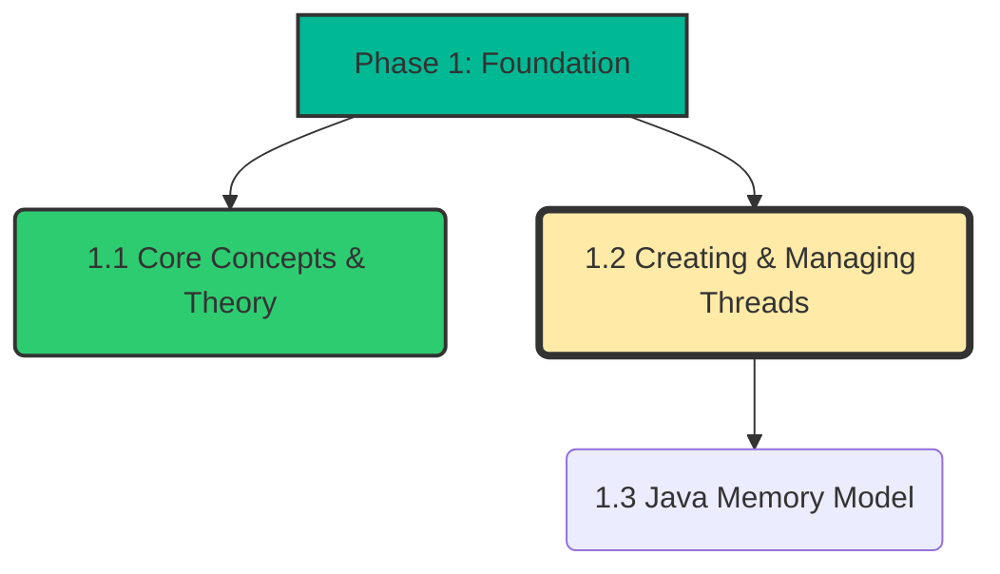
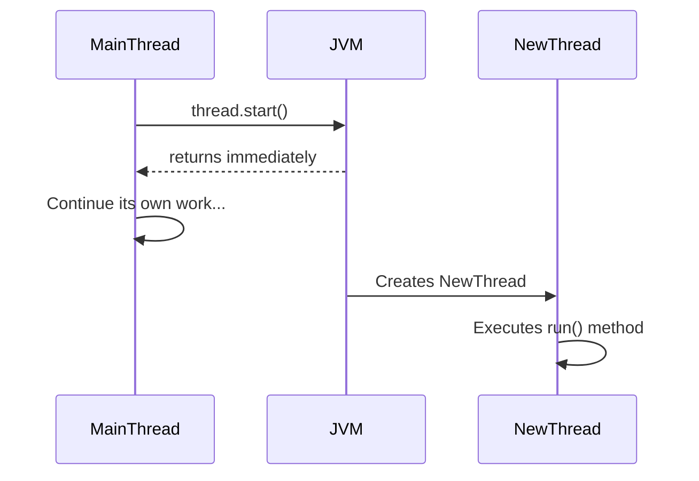
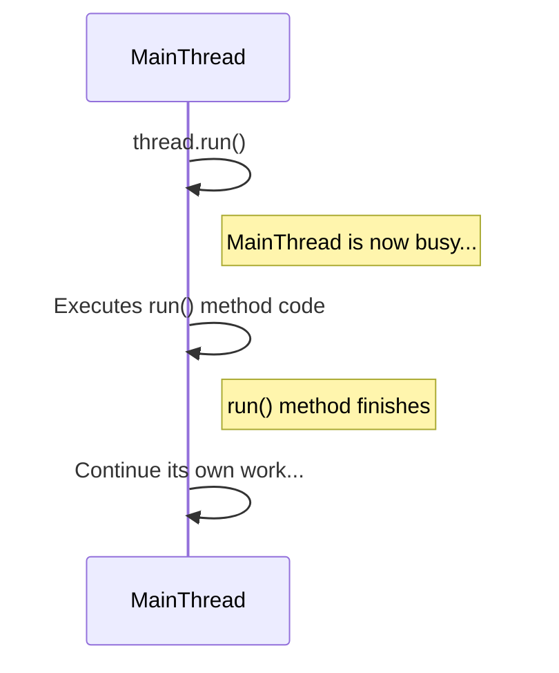
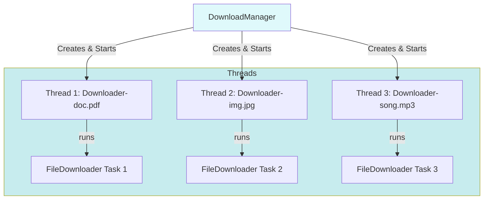

---
## 🎯 1.2 Creating & Managing Threads in Java

### 🗺️ Where We Are
Mawa, manam **Phase 1: Foundation - Threading Basics** lo unnam. Mundu section lo theory (Process vs Thread, Concurrency vs Parallelism) chusam. Ippudu practical ga Java lo threads ela create cheyalo nerchukuntam. 🔥



### 💭 Quick Recap
💭 Gurtunda ra? Manam `Thread` ante ento nerchukunnam. Thread is a lightweight sub-process, and it shares memory with other threads of the same process. Ippudu aa threads ni Java lo ela create cheyalo chuddam.

---

### 🤔 What & Why: How to Create a Thread?

**Problem Statement:**
Java lo oka separate pani (task) ni background lo run cheyali anukuntunnam. For example, oka e-commerce website lo order place chesinaka, user ki "Order placed successfully" ani cheppi, background lo invoice generate chesi email pampali. Ee background pani kosam oka separate thread ela create cheyali?

**Solution:**
Java manaki threads create cheyadaniki rendu primary ways ichindi:
1.  **`Thread` class ni extend cheyadam:** Mana class ni `java.lang.Thread` class ki child ga create cheyadam.
2.  **`Runnable` interface ni implement cheyadam:** Mana class `java.lang.Runnable` interface ni implement cheyadam.

Ee rendu ways lo, **Runnable interface ni implement cheyadam anedi best practice and most recommended way**. 🔥 Enduko anedi kindha detailed ga chuddam.

**Real-World Analogy: 🏠 Building a Custom Car**

Imagine nuvvu oka custom car tayaru cheyali anukuntunnav.
1.  **Extending `Thread` class (Inheritance):**
    -   Idi ela ante, nuvvu direct ga oka existing car (e.g., a Maruti Swift) ni teskoni, daaniki modifications (spoiler, new color) chesinattu.
    -   **Analogy:** Nuvvu `Car` class ni extend chestunnav. So, nee class `MyAwesomeCar` anedi `is-a` Car.
    -   **Problem:** Nuvvu okasari Maruti Swift ni extend chesaka, malli inkoka car type (like a Truck) ni extend cheyalem, endukante Java lo multiple inheritance ledu. ❌

2.  **Implementing `Runnable` interface (Composition):**
    -   Idi ela ante, nuvvu car body, chassis, wheels anni teskoni, daaniki oka powerful engine (the "task" or "runnable" part) ni fit chesinattu.
    -   **Analogy:** Nee class `SuperFastEngine` anedi `has-a` capability to run. Idi `Runnable`. Nuvvu ee engine ni car lo pettొచ్చు, truck lo pettొచ్చు, or even a boat lo kuda pettొచ్చు.
    -   **Advantage:** Idi chala flexible. Nee "task" (`Runnable`) ni, aa task ni run chese "worker" (`Thread`) nunchi separate chestunnav. ✅ Idi clean design.

---

### 📚 Detailed Explanation & Code

#### Method 1: Extending `java.lang.Thread` Class

Ee approach lo, manam mana class ni `Thread` class ki child ga chestam and `run()` method ni override chestam.

**Class Documentation: `MyThread`**
```java
/**
 * 🎯 Ee class Thread class ni extend chesi oka custom thread ni create chestundi.
 * Ee thread pani enti ante, 1 nunchi 5 varaku print cheyadam.
 *
 * When to use: Simple scenarios lo, and mee class ki inkoka class ni extend
 * cheyalsina avasaram ledu anukunapudu.
 * When NOT to use: Mee class ki already inkoka parent class unte (e.g., Applet),
 * ee method use cheyalem.
 */
class MyThread extends Thread {
    /**
     * run() method ni override cheyali. Ee method lo ne thread cheyalsina pani (task) ni rastam.
     * JVM ee code ni execute cheyadaniki oka kotha thread ni start chestundi.
     */
    @Override
    public void run() {
        // ... task logic ...
    }
}
```

**💻 Code Example 1: Simplest Possible ✨**
**Scenario:** Oka simple thread create chesi, adi 1 nunchi 5 varaku print cheyali. Main thread kuda parallel ga daani pani adi cheskuntundi.

```java
// File: java-concurrency-roadmap-telugu/Phase-01-Foundation-Threading-Basics/code-examples/ExtendsThreadExample.java

package org.example;

/**
 * 🎯 Ee example lo Thread class ni extend chesi oka custom thread ni create chestunnam.
 * Ee thread pani enti ante, 1 nunchi 5 varaku print cheyadam.
 */
class MyThread extends Thread {

    /**
     * run() method ni override cheyali. Ee method lo ne thread cheyalsina pani (task) ni rastam.
     * JVM ee code ni execute cheyadaniki oka kotha thread ni start chestundi.
     */
    @Override
    public void run() {
        // Ee thread em cheyali? 1 to 5 print cheyali, prathi number ki madhya 500ms gap ivvali.
        try {
            for (int i = 1; i <= 5; i++) {
                System.out.println("🔥 MyThread (extends Thread): " + i);
                // Konchem gap isdam, lekapothe antha fast ga aipotundi.
                Thread.sleep(500); // 500 milliseconds aagu
            }
        } catch (InterruptedException e) {
            // Thread ni evaraina madhyalo lepithe (interrupt), ee exception vastundi.
            System.out.println("MyThread interrupted anukunta mawa!");
        }
    }
}

public class ExtendsThreadExample {
    public static void main(String[] args) {
        System.out.println("🚀 Main thread started.");

        // Step 1: Mana custom thread class ki object create cheyali.
        MyThread thread1 = new MyThread();

        // Step 2: start() method call cheyali. Idi chala important!
        // start() call cheste ne kotha thread create aithadi.
        // Direct ga thread1.run() call cheste, kotha thread create avvadu,
        // main thread lone aa code run aithadi. (📌 Next topic ide, detailed ga chuddam).
        thread1.start();

        // Main thread pani adi cheskuntundi.
        for (int i = 1; i <= 3; i++) {
            System.out.println("✅ Main thread pani chestundi... " + i);
            try {
                Thread.sleep(700);
            } catch (InterruptedException e) {
                // handle exception
            }
        }

        System.out.println("🏁 Main thread finished.");
    }
}
```
**Output (Example):**
```
🚀 Main thread started.
✅ Main thread pani chestundi... 1
🔥 MyThread (extends Thread): 1
🔥 MyThread (extends Thread): 2
✅ Main thread pani chestundi... 2
🔥 MyThread (extends Thread): 3
✅ Main thread pani chestundi... 3
🔥 MyThread (extends Thread): 4
🏁 Main thread finished.
🔥 MyThread (extends Thread): 5
```
*(Note: Output order prathi sari marochu, endukante thread scheduling anedi OS control lo untadi.)*

---

#### Method 2: Implementing `java.lang.Runnable` Interface (Recommended ⭐)

Ee approach lo, manam `Runnable` interface ni implement chesi, `run()` method lo task define chestam. Tarvata, `Thread` class object create chesi, daani constructor ki ee `Runnable` object ni pass chestam.

**Interface Documentation: `Runnable`**
```java
/**
 * 🔌 Ee interface enduku undi?
 * Idi "task" ni "worker" (Thread) nunchi separate cheyadaniki design chesaru.
 * Deentlo okate okka method untadi: public void run().
 * Ee interface implement chese class, "I am a task that can be run" ani cheptundi.
 */
@FunctionalInterface
public interface Runnable {
    public abstract void run();
}
```

**💻 Code Example 2: Basic Use Case**
**Scenario:** Same, 1 nunchi 5 varaku print cheyali, kaani ee sari `Runnable` interface use chesi cheddam.

```java
// File: java-concurrency-roadmap-telugu/Phase-01-Foundation-Threading-Basics/code-examples/ImplementsRunnableExample.java

package org.example;

/**
 * 🎯 Ee example lo Runnable interface ni implement chesi oka task create chestunnam.
 * Idi thread ni create cheyadaniki recommended way.
 */
class MyRunnable implements Runnable {

    /**
     * run() method lo manam cheyalsina task ni define chestam.
     */
    @Override
    public void run() {
        try {
            for (int i = 1; i <= 5; i++) {
                System.out.println("🔥 MyRunnable (implements Runnable): " + i);
                Thread.sleep(500);
            }
        } catch (InterruptedException e) {
            System.out.println("MyRunnable interrupted anukunta mawa!");
        }
    }
}

public class ImplementsRunnableExample {
    public static void main(String[] args) {
        System.out.println("🚀 Main thread started.");

        // Step 1: Mana Runnable task ki object create cheyali.
        MyRunnable myRunnable = new MyRunnable();

        // Step 2: Thread class object create chesi, daani constructor ki mana runnable task ni pass cheyali.
        // Manam task ni (MyRunnable) thread behavior (Thread class) nunchi separate chestunnam.
        Thread thread1 = new Thread(myRunnable);

        // Step 3: start() method call cheyali to create a new thread.
        thread1.start();

        // Main thread pani adi cheskuntundi.
        for (int i = 1; i <= 3; i++) {
            System.out.println("✅ Main thread pani chestundi... " + i);
            try {
                Thread.sleep(700);
            } catch (InterruptedException e) {
                // handle exception
            }
        }

        System.out.println("🏁 Main thread finished.");
    }
}
```
**Output (Example):**
*(Output will be similar to the previous example, with the text changed to "MyRunnable...").*

---

#### Example 3: Intermediate - Sharing a Single Task 🤝
**Scenario:** Okate `Runnable` instance ni multiple threads execute cheste emavutundi? Idi `Runnable` approach yokka main power. Okate task object (state tho paatu) ni multiple workers (threads) share cheskovachu. E-commerce site lo, okate shopping cart object ni multiple threads access chesinattu.

```java
// File: java-concurrency-roadmap-telugu/Phase-01-Foundation-Threading-Basics/code-examples/SharedRunnableExample.java
package org.example.intermediate;

/**
 * 🎯 Ee example lo, okate Runnable instance ni multiple threads tho ela share cheskovacho chuddam.
 * Idi 'implements Runnable' approach yokka main advantage lo okati.
 *
 * Scenario: Oka bank account undi. Multiple people (threads) okate sari aa account nunchi
 * paisal a 'withdraw' cheyadaniki try chestunnaru.
 */
class BankAccount {
    private int balance;

    public BankAccount(int initialBalance) {
        this.balance = initialBalance;
    }

    // synchronized keyword gurinchi manam Phase 2 lo detailed ga matladukuntam.
    // Ippatiki, idi ee method ni okate thread okate sari access cheyagaladu ani gurthupettuko.
    // Leka pothe race condition vastundi.
    public synchronized void withdraw(int amount) {
        if (balance >= amount) {
            System.out.println(Thread.currentThread().getName() + " is withdrawing " + amount);
            try {
                // Simulating some processing time
                Thread.sleep(1000);
            } catch (InterruptedException e) {
                e.printStackTrace();
            }
            balance -= amount;
            System.out.println(Thread.currentThread().getName() + " successfully withdrew. New balance: " + balance);
        } else {
            System.out.println(Thread.currentThread().getName() + " tried to withdraw " + amount + ", but insufficient balance. Current balance: " + balance);
        }
    }
}

/**
 * Ee Runnable task, bank account nunchi paisal a teeyadaniki try chestundi.
 */
class WithdrawalTask implements Runnable {
    // Okate BankAccount object ni multiple threads share cheskuntai.
    private final BankAccount account;

    public WithdrawalTask(BankAccount account) {
        this.account = account;
    }

    @Override
    public void run() {
        // Prathi thread 100 rupees withdraw cheyadaniki try chestundi.
        account.withdraw(100);
    }
}

public class SharedRunnableExample {
    public static void main(String[] args) {
        // Step 1: Okate BankAccount object create cheddam. Initial balance 250.
        BankAccount sharedAccount = new BankAccount(250);

        // Step 2: Okate Runnable task object create cheddam, which holds the shared account.
        WithdrawalTask withdrawalTask = new WithdrawalTask(sharedAccount);

        // Step 3: Ee okate task ni multiple threads ki isdam.
        // Ante, mugguru persons (threads) okate account (shared object) mida pani chestunnaru.
        Thread person1 = new Thread(withdrawalTask, "Person-1");
        Thread person2 = new Thread(withdrawalTask, "Person-2");
        Thread person3 = new Thread(withdrawalTask, "Person-3");

        System.out.println("🚀 Bank account balance before transactions: 250");
        System.out.println("Mugguru okate sari 100 withdraw cheyadaniki try chestunnaru...");

        // Start all threads
        person1.start();
        person2.start();
        person3.start();
    }
}
```
**Output (Example):**
```
🚀 Bank account balance before transactions: 250
Mugguru okate sari 100 withdraw cheyadaniki try chestunnaru...
Person-1 is withdrawing 100
Person-1 successfully withdrew. New balance: 150
Person-2 is withdrawing 100
Person-2 successfully withdrew. New balance: 50
Person-3 tried to withdraw 100, but insufficient balance. Current balance: 50
```
**Explanation:** Chudu mawa, `sharedAccount` and `withdrawalTask` anevi okate objects. Daanini `person1`, `person2`, `person3` ane threads share cheskunnai. Anduke balance correct ga update aindi. (📌 `synchronized` keyword gurinchi Phase 2 lo chala detailed ga chuddam, ippatiki adi race conditions ni aputundi ani gurthupettuko).

---

### 📊 Comparison & When to Use

| Feature                 | `extends Thread`                                       | `implements Runnable` (⭐ Recommended)                  |
| ----------------------- | ------------------------------------------------------ | ----------------------------------------------------- |
| **Inheritance**         | Class ni `Thread` ki child ga chestundi. `is-a` relationship. | Class `Runnable` ni implement chestundi. `has-a` task. |
| **Multiple Inheritance**| Cheyalem. Java doesn't support it. ❌                   | Possible. Mana class inkoka class ni extend cheskovachu. ✅ |
| **Design**              | Tightly coupled. Task and worker (Thread) are mixed.   | Loosely coupled. Task is separate from the worker. Clean design. 👍 |
| **Object Sharing**      | Difficult. Prathi thread ki oka kotha object create aithadi. | Easy. Okate `Runnable` object ni multiple threads share cheskovachu. |
| **Use Case**            | Chala simple, quick tests kosam.                       | Almost all production-level scenarios. Best practice. |

**🔥 Key Point:** `Runnable` approach manaki loose coupling and more flexibility isthundi. Task (pani) veru, aa pani chese vadu (worker/thread) veru. Ee separation valla code maintain cheyadam and reuse cheyadam chala easy aithundi.

### ✨ Key Takeaways
1.  **Rendu Ways:** Java lo threads create cheyadaniki rendu வழிகள் unnai: `extends Thread` or `implements Runnable`. 💪
2.  **Best Practice:** `implements Runnable` is the recommended approach. Idi clean design and flexibility isthundi. 🚀
3.  **`run()` Method:** Thread cheyalsina pani antha `run()` method lo rastam.
4.  **`start()` Method:** Kotha thread ni create chesi, `run()` method ni call cheyadaniki `start()` method use chestam. Direct ga `run()` call cheyakudadu.

### ➡️ Next Step
Baga nerchukunnam ra! 🎉 Ippudu threads ela create cheyalo ardamaindi. Kaani `start()` ki and `run()` ki madhya unna difference entidi? Direct ga `run()` call cheste em aithadi? Ee important question ki answer manam next section lo chuddam: **"Difference between start() vs run()"**. 🔥

---
---

## 🤔 What & Why: `start()` vs `run()` Method

**Problem Statement:**
Manam mundu examples lo `thread.start()` ani call chesam. Kotha thread create cheyadaniki `start()` vaadali ani cheppukunnam. Kaani, `Thread` class lo `run()` method kuda undi kada, daanini direct ga `thread.run()` ani call cheste em avtundi? Rendu `run()` method ne execute chestai anipistundi, mari difference entidi? 🔥 This is one of the most important and common interview questions!

**Solution:**
Ee rendu methods madhya chala pedda difference undi. Simple ga cheppali ante:
-   **`thread.start()`:** Creates a **new thread** and executes the code inside the `run()` method in that new thread. Idi real multithreading. 🚀
-   **`thread.run()`:** **Does not create a new thread**. It executes the code inside the `run()` method in the **current thread** (e.g., the `main` thread), just like a normal method call. Idi multithreading kaadu. 🚶‍♂️

**Real-World Analogy: 🏠 Manager & Worker**

Imagine nuvvu oka Manager (`main` thread) vi. Neeku oka pani undi, adi cheyadaniki oka Worker (`Thread` object) unnadu.
-   **Calling `start()`:**
    -   Nuvvu Worker ki velli, "Ee pani tesko, start chey" ani cheptav.
    -   Worker aa pani teskoni velli, **separate ga** daani pani adi cheskuntundi.
    -   Ee time lo nuvvu (Manager) free. Nuvvu inko pani cheskovachu.
    -   Idhi **asynchronous** and **multi-threaded**.

-   **Calling `run()`:**
    -   Nuvvu Worker daggara unna pani list chusi, "Ee pani nene chesta le" anukoni, **nuvve aa pani cheyadam start chestav**.
    -   Worker em cheyatledu, silent ga unnadu. Nuvvu (Manager) aa pani antha complete ayyevaraku busy ga untav.
    -   Idhi **synchronous** and **single-threaded**.

### 📚 Detailed Explanation & Code

#### `public void start()`
-   Ee method `java.lang.Thread` class lo undi.
-   Idi call chesinapudu, idi Java Virtual Machine (JVM) tho matladutundi.
-   JVM oka kotha thread of execution ni create chestundi.
-   Aa kotha thread, `run()` method lo unna code ni execute chestundi.
-   `start()` method ni okasari kanna ekkuva sarlu call cheste `IllegalThreadStateException` vastundi. 🔥

#### `public void run()`
-   Ee method `Runnable` interface lo define cheyabaddadi and `Thread` class lo override cheyabaddadi.
-   Deentlo thread cheyalsina actual logic (task) untadi.
-   Manam direct ga `run()` method ni call cheste, adi oka normal method call laaga current thread lo ne execute aipotundi. Kotha thread em create avvadu.

### 🧠 Mental Model Diagram


**`start()` Method Flow:** `main` thread `start()` ni call chesi, ventane daani pani adi continue chestundi. JVM background lo oka `NewThread` create chesi, daantlo `run()` method ni execute chestundi.


**`run()` Method Flow:** `main` thread `run()` ni call chestundi. Adi oka normal function call laaga, `run()` method antha complete ayyevaraku `main` thread wait chestundi.

### 💻 Code Example: `StartVsRunExample.java`
**Scenario:** Rendu tasks create cheddam. First time `start()` use chesi, second time `run()` use chesi call cheddam. Difference output lo clear ga chuddam.

```java
// File: java-concurrency-roadmap-telugu/Phase-01-Foundation-Threading-Basics/code-examples/StartVsRunExample.java
package org.example;

class MyTask extends Thread {
    private String taskName;

    public MyTask(String taskName) {
        this.taskName = taskName;
    }

    @Override
    public void run() {
        System.out.println("🔥 Task '" + taskName + "' is running in thread: " + Thread.currentThread().getName());
        for (int i = 1; i <= 3; i++) {
            System.out.println("... " + taskName + " printing " + i);
            try {
                Thread.sleep(500);
            } catch (InterruptedException e) {
                // handle exception
            }
        }
        System.out.println("🏁 Task '" + taskName + "' finished.");
    }
}

public class StartVsRunExample {
    public static void main(String[] args) {
        System.out.println("🚀 Main thread started: " + Thread.currentThread().getName());
        System.out.println("---------------------------------------------");

        // Scenario 1: Using start() method - Correct way to start a thread
        System.out.println("SCENARIO 1: Using thread.start()");
        MyTask task1 = new MyTask("Start-Task-1");
        MyTask task2 = new MyTask("Start-Task-2");

        // start() method call cheste, JVM oka kotha thread ni create chesi, aa kotha thread lo run() method ni call chestundi.
        // Ekkada rendu kotha threads (Thread-0, Thread-1) create avutai. Main thread tho paatu parallel ga run avutai.
        task1.start();
        task2.start();

        // Konchem aagudam, ee threads complete ayyevaraku.
        try {
            task1.join(); // main thread waits for task1 to finish
            task2.join(); // main thread waits for task2 to finish
        } catch (InterruptedException e) {
            // handle exception
        }

        System.out.println("---------------------------------------------");
        System.out.println("SCENARIO 2: Using thread.run()");

        // Scenario 2: Using run() method directly - WRONG way
        MyTask task3 = new MyTask("Run-Task-3");
        MyTask task4 = new MyTask("Run-Task-4");

        // run() method ni direct ga call cheste, kotha thread em create avvadu.
        // Idi oka normal method call laaga, main thread lone execute aipotundi.
        // Ante, task3 antha complete ayyake, task4 start aithadi. (Sequential execution)
        task3.run();
        task4.run();

        System.out.println("---------------------------------------------");
        System.out.println("🏁 Main thread finished.");
    }
}
```
**Output (Example):**
```
🚀 Main thread started: main
---------------------------------------------
SCENARIO 1: Using thread.start()
🔥 Task 'Start-Task-1' is running in thread: Thread-0
🔥 Task 'Start-Task-2' is running in thread: Thread-1
... Start-Task-1 printing 1
... Start-Task-2 printing 1
... Start-Task-1 printing 2
... Start-Task-2 printing 2
... Start-Task-1 printing 3
... Start-Task-2 printing 3
🏁 Task 'Start-Task-1' finished.
🏁 Task 'Start-Task-2' finished.
---------------------------------------------
SCENARIO 2: Using thread.run()
🔥 Task 'Run-Task-3' is running in thread: main
... Run-Task-3 printing 1
... Run-Task-3 printing 2
... Run-Task-3 printing 3
🏁 Task 'Run-Task-3' finished.
🔥 Task 'Run-Task-4' is running in thread: main
... Run-Task-4 printing 1
... Run-Task-4 printing 2
... Run-Task-4 printing 3
🏁 Task 'Run-Task-4' finished.
---------------------------------------------
🏁 Main thread finished.
```
**Output Analysis:**
-   **Scenario 1 (`start()`):** Chudu mawa, `Start-Task-1` and `Start-Task-2` anevi `Thread-0` and `Thread-1` ane kotha threads lo run ayyayi. Avi rendu parallel ga (interleaved) run ayyayi.
-   **Scenario 2 (`run()`):** `Run-Task-3` and `Run-Task-4` anevi `main` thread lo ne run ayyayi. Task-3 antha complete ayyake, Task-4 start aindi. Idi sequential execution.

### 📊 Comparison Table: `start()` vs `run()`

| Feature               | `thread.start()`                               | `thread.run()`                                           |
| --------------------- | ---------------------------------------------- | -------------------------------------------------------- |
| **New Thread**        | Creates a new thread. ✅                       | Does NOT create a new thread. ❌                         |
| **Execution**         | Asynchronous. `run()` method is executed by the new thread. | Synchronous. `run()` is executed by the calling thread. |
| **Multithreading**    | Achieves multithreading. 🚀                    | Does not achieve multithreading. 🚶‍♂️                       |
| **Method Call**       | Can be called only ONCE per thread object.     | Can be called multiple times, like a normal method.    |
| **Exception**         | `IllegalThreadStateException` if called more than once. | No such exception.                                     |
| **Belongs to**        | `java.lang.Thread` class.                      | Defined in `Runnable`, implemented in `Thread`.          |

### ✨ Key Takeaways
1.  **For Multithreading, Use `start()`:** Nijanga oka kotha thread create chesi, parallel ga pani cheyinchali ante, **ALWAYS** call `thread.start()`.
2.  **`run()` is just a method:** `thread.run()` ni call cheyadam ante, oka normal object lo unna method ni call chesinatte. No magic, no new thread.
3.  **Interview King 👑:** Ee question interviews lo 100% vastundi. Analogy, code example, and comparison table tho explain cheste, full marks padipothai!

### ➡️ Next Step
Super mawa! Ippudu manaki thread ela create cheyali, and daani ela *correct* ga start cheyalo telisindi. Next manam inkonni important thread management concepts chuddam: **`Thread priorities`, `daemon threads`, `Thread.sleep()`, and `Thread.join()`**. Let's keep going! 🔥

---
---

## 🚦 Thread Management: `sleep()`, `yield()`, and `join()`

Threads create cheyadam, start cheyadam first step. But వాటిని control cheyadam, వాటి flow ni manage cheyadam chala important. Ee section lo, manam three fundamental methods nerchukuntam.

**Real-World Analogy: 🏃‍♂️🏃‍♀️ Runners in a Race**

-   **`sleep()`:** Oka runner race madhyalo aagi, bench meeda kurchoni 2 minutes rest teskovadam lanti di. Aa time lo, atanu race lo participate cheyatledu. Time aipogane, malli race lo continue avtadu.
-   **`yield()`:** Oka runner, pakkana inko runner fast ga vastunte chusi, "Nuvvu mundu vellu bro" ani daari ivvadam lanti di. Atanu aagaledu, just pakkaki tappukuni, vere vaallaki chance ichadu. Scheduler ventane malli itanike chance ivvochu.
-   **`join()`:** Relay race lo, second runner, first runner vachi baton (stick) ichenta varaku start line daggara wait cheyadam lanti di. First runner pani aipothe gani, second runner pani start avvadu.

---

### 😴 `Thread.sleep(long millis)`

-   **What it does:** Idi oka `static` method. Idi `current thread` ni `TIMED_WAITING` state loki pampistundi for the specified number of milliseconds. Ante, aa thread kontha sep aagipotundi.
-   **Why use it:** Vere threads ki CPU time ivvadaniki, or oka task ni kontha delay tho cheyadaniki (e.g., polling for a resource every 5 seconds).
-   **Important:** `sleep()` time guarantee ga antha sep untundi ani ledu. It can be woken up earlier if it is interrupted, which throws an `InterruptedException`. Anduke `try-catch` block compulsory.
-   **Lock Release:** Thread `sleep` lo ఉన్నప్పుడు, adi tana daggara unna locks ni release **cheyadu**. (📌 Ee point chala important, manam Synchronization (Phase 2) lo deeni gurinchi detailed ga matladukuntam).

### 🤝 `Thread.yield()`

-   **What it does:** Idi kuda oka `static` method. Idi thread scheduler ki oka hint isthundi: "Nenu ippudu CPU vadaladaniki ready ga unnanu. Na lanti priority unna vere thread edaina unte, daaniki chance ivvu".
-   **No Guarantee:** Scheduler ee hint ni follow avvochu, or ignore cheyochu. Scheduler anukunte, "Nuvve continue chey" ani ade thread ki malli chance ivvochu. Anduke, deeni meeda depend avvakudadu.
-   **State:** A thread that `yields` goes from `RUNNING` to `RUNNABLE` state. It doesn't go into `WAITING` or `BLOCKED`.
-   **Use Case:** Production code lo `yield()` ni chala rarely use chestaru. Idi mainly debugging or testing scenarios lo vaadataru to reproduce race conditions.

### 🙏 `thread.join()`

-   **What it does:** Idi oka non-static method. Oka thread (`t1`) inkoka thread (`t2`) mida `t2.join()` ani call cheste, `t1` anedi `t2` aipoyenta (terminate ayyenta) varaku `WAITING` state lo untundi.
-   **Why use it:** Oka thread yokka output, inkoka thread ki input ga unnapudu idi chala useful. Main thread, child threads anni aipoyaka final result ni calculate cheyali anukunapudu `join()` vaadali.
-   **Variations:**
    -   `join()`: Waits forever until the thread terminates.
    -   `join(long millis)`: Waits for a maximum of the specified milliseconds. Aa time lo kuda thread complete kakapothe, calling thread continue aipotundi.

---

### 💻 Code Example: `SleepYieldJoinExample.java`

```java
// File: java-concurrency-roadmap-telugu/Phase-01-Foundation-Threading-Basics/code-examples/SleepYieldJoinExample.java
package org.example.management;

/**
 * 🎯 Ee example lo, manam chala important thread management methods ni chuddam:
 * 1. Thread.sleep() - Kontha sep aa thread ni aapataniki.
 * 2. Thread.yield() - Current thread, CPU ni vere threads ki ivvadaniki.
 * 3. thread.join()  - Oka thread, inko thread aipoyenta varaku wait cheyadaniki.
 */
public class SleepYieldJoinExample {

    public static void main(String[] args) {
        // --- sleep() Example ---
        System.out.println("--- 😴 Thread.sleep() Example ---");
        System.out.println("Main thread is going to sleep for 2 seconds.");
        try {
            // Main thread ni 2000 milliseconds (2 seconds) aపుతున్నాం.
            Thread.sleep(2000);
        } catch (InterruptedException e) {
            // Sleep lo unnapudu interrupt vaste ee exception vastundi.
            e.printStackTrace();
        }
        System.out.println("Main thread woke up after 2 seconds.");
        System.out.println("-------------------------------------\n");


        // --- yield() Example ---
        // yield() behavior is not guaranteed, so idi just oka demonstration.
        // Asal idi production code lo almost vaadaru.
        System.out.println("--- 🤝 Thread.yield() Example ---");
        Runnable yieldingTask = () -> {
            for (int i = 0; i < 3; i++) {
                System.out.println(Thread.currentThread().getName() + ": Yielding my turn...");
                Thread.yield(); // "Nenu ready, kaani vere thread ki chance ista"
            }
        };
        Thread t1 = new Thread(yieldingTask, "Yielding-Thread");
        t1.start();
        // Main thread kuda yield chestundi, to give t1 a chance.
        for (int i = 0; i < 3; i++) {
            System.out.println(Thread.currentThread().getName() + ": Yielding my turn...");
            Thread.yield();
        }
        // t1 aipoyenta varaku wait cheddam, next example clean ga start avvadaniki.
        try { t1.join(); } catch (InterruptedException e) {}
        System.out.println("-------------------------------------\n");


        // --- join() Example ---
        System.out.println("--- 🙏 thread.join() Example ---");
        System.out.println("Main thread starting a worker thread.");
        Thread workerThread = new Thread(() -> {
            System.out.println("Worker thread started. Pani cheyadaniki 3 seconds padutundi.");
            try {
                Thread.sleep(3000);
            } catch (InterruptedException e) {
                e.printStackTrace();
            }
            System.out.println("Worker thread finished its work.");
        }, "Worker-Thread");

        workerThread.start();

        System.out.println("Main thread is waiting for the worker thread to finish...");
        try {
            // Main thread, workerThread aipoyenta varaku ikkade aagipotundi.
            workerThread.join();
        } catch (InterruptedException e) {
            e.printStackTrace();
        }
        System.out.println("Main thread: Worker thread has finished. Now I can proceed.");
        System.out.println("-------------------------------------");
    }
}
```

### 📊 Comparison Table

| Feature        | `sleep(millis)`                                  | `yield()`                                       | `join()`                                              |
| -------------- | ------------------------------------------------ | ----------------------------------------------- | ----------------------------------------------------- |
| **Method Type**| `static`                                         | `static`                                        | `non-static`                                          |
| **Purpose**    | Pause execution for a specific time.             | Hint to scheduler to run another thread.        | Wait for another thread to die.                       |
| **State Change**| `RUNNING` -> `TIMED_WAITING`                     | `RUNNING` -> `RUNNABLE`                         | `RUNNING` -> `WAITING`                                |
| **Guaranteed?**| Yes (minimum time). Can be interrupted.          | No guarantee. Scheduler can ignore it.          | Yes. Waits until the thread terminates or timeout.    |
| **Lock Release**| **No**. Keeps locks. 🔒                         | **No**. Keeps locks. 🔒                         | N/A (Does not hold locks itself)                      |
| **Common Use** | Simulating delays, polling.                      | Very rare. Maybe for debugging.                 | Waiting for results from other threads.               |

---
---

## 🚀 Priorities and 👻 Daemon Threads

Inkonni advanced concepts chuddam - thread priorities and daemon threads.

### 🚀 Thread Priorities

-   **What are they?** Prathi Java thread ki oka priority untadi, oka integer number between 1 and 10.
    -   `Thread.MIN_PRIORITY` (value 1)
    -   `Thread.NORM_PRIORITY` (value 5) - Default priority
    -   `Thread.MAX_PRIORITY` (value 10)
-   **Why use them?** Thread scheduler ki oka hint ivvadaniki - "Hey, ee thread konchem important, deeniki ekkuva CPU time ivvu".
-   **No Guarantee!** 🔥 **Idi chala important point.** Thread priorities are **not guaranteed**. Adi OS and JVM implementation mida depend avtundi. Windows lo priorities oka laaga work avvochu, Linux lo inko laaga. So, mee program logic ni priorities mida base chesi **rayakudadu**. It should only be used as a performance optimization hint.

**Analogy: 🏥 Hospital Emergency Room**
-   `MAX_PRIORITY`: Severe heart attack patient. Doctors (CPU) will attend to them immediately.
-   `NORM_PRIORITY`: Patient with a broken arm. Important, but can wait a little.
-   `MIN_PRIORITY`: Patient with a minor cold. Will be attended to when doctors are free.
Kaani, idantha hospital policy (OS scheduler) batti untadi.

### 👻 Daemon Threads

-   **What are they?** Daemon threads are low-priority threads that run in the background to provide services to user threads.
-   **Key Property:** The JVM exits when the **only** threads running are daemon threads. Ante, anni user threads (like the `main` thread) aipothe, JVM daemon threads kosam wait cheyadu, ventane application ni shutdown chestundi.
-   **When to use?** Background tasks kosam. For example, a garbage collector thread, or a thread that cleans up temporary files, or a thread that checks for application updates every 10 minutes. Ee panulu main application tho paatu aagipovali.
-   **How to set:** `thread.setDaemon(true);`. Idi `thread.start()` method kanna mundu call cheyali. Leka pothe `IllegalThreadStateException` vastundi.

**Analogy: 🧹 Housekeeping Staff in a Hotel**
-   **User Threads:** Hotel guests. Vallu unnantha varake hotel open lo untadi.
-   **Daemon Threads:** Housekeeping staff (cleaners). Vallu guests kosam pani chestaru (cleaning rooms, providing services). Antha mandi guests check-out aipothe, housekeeping pani kuda aipotundi, and hotel (JVM) close chestaru.

---

### 💻 Code Example: `PrioritiesAndDaemonExample.java`

```java
// File: java-concurrency-roadmap-telugu/Phase-01-Foundation-Threading-Basics/code-examples/PrioritiesAndDaemonExample.java
package org.example.management;

/**
 * 🎯 Ee example lo, manam inko rendu important concepts chuddam:
 * 1. Thread Priorities - Thread scheduler ki ఏ thread ki ekkuva importance ivvalo cheppadaniki.
 * 2. Daemon Threads - Background lo pani chese threads, main application aagipothe ive kuda aagipotai.
 */
public class PrioritiesAndDaemonExample {
    public static void main(String[] args) {

        // --- Priorities Example ---
        System.out.println("--- 🚀 Thread Priorities Example ---");
        Runnable priorityTask = () -> {
            for (int i = 0; i < 5; i++) {
                System.out.println(Thread.currentThread().getName() + " is running.");
            }
        };

        Thread lowPriorityThread = new Thread(priorityTask, "LowPriorityThread");
        Thread highPriorityThread = new Thread(priorityTask, "HighPriorityThread");

        // Set priorities
        // Priorities are just a hint to the scheduler. Guarantee em ledu.
        lowPriorityThread.setPriority(Thread.MIN_PRIORITY); // Priority 1
        highPriorityThread.setPriority(Thread.MAX_PRIORITY); // Priority 10

        System.out.println("Starting threads with different priorities...");
        highPriorityThread.start();
        lowPriorityThread.start();

        // Wait for them to finish before starting the next example
        try {
            lowPriorityThread.join();
            highPriorityThread.join();
        } catch (InterruptedException e) {}
        System.out.println("-------------------------------------\n");


        // --- Daemon Thread Example ---
        System.out.println("--- 👻 Daemon Thread Example ---");
        Thread daemonThread = new Thread(() -> {
            // Ee thread antha sep run avtane untadi.
            while (true) {
                System.out.println("Daemon thread is running in the background...");
                try {
                    Thread.sleep(1000);
                } catch (InterruptedException e) {
                    // This might happen if main thread exits.
                    break;
                }
            }
        }, "MyDaemonThread");

        // Ee thread ni daemon ga set chestunnam. Idi main thread aagipogane aagipotundi.
        daemonThread.setDaemon(true);
        daemonThread.start();

        System.out.println("Main thread is running for 3 seconds...");
        try {
            Thread.sleep(3000);
        } catch (InterruptedException e) {}

        System.out.println("Main thread is finishing. JVM will now exit, stopping the daemon thread.");
        // Main thread aipoyindi, so JVM antha non-daemon threads aipoyayi anukuni exit aipotundi.
        // Daemon thread antha abruptly stop aipotundi.
    }
}
```
**Output Analysis:**
-   **Priorities:** Output chuste, `HighPriorityThread` ki ekkuva chance vachindi anipinchachu, but idi guarantee ledu. Prathi run lo marochu.
-   **Daemon:** `Main thread` 3 seconds aagipoyaka exit aipotundi. Ventane, `Daemon thread` kuda abruptly stop aipotundi. Adi `while(true)` loop lo unna kuda, JVM daani kosam wait cheyadu.

---
---

## 🛑 Thread Interruption

Oka thread ni start cheyadam telusu, but daanini aapaali ante ela? `thread.stop()` ane method undi, kaani adi chala dangerous and deprecated. ☠️ Correct way enti ante **Interruption mechanism** use cheyadam.

-   **What is Interruption?** Idi oka thread ki "Hey, nuvvu chese pani aapey" ani cheppe oka polite request. It doesn't forcefully stop the thread. It just sets a boolean flag called the "interrupt status" on the thread.
-   **How it works:** Aa thread, daani pani madhyalo appudappudu ee flag ni check cheskovali. "Nannu evaraina aapaali anukuntunnara?" ani. Flag `true` unte, appudu a thread gracefully (daani pani antha clean up cheskuni) aagipotundi.
-   **Three Key Methods:**
    1.  `public void thread.interrupt()`: Ee method ni vere thread nunchi call chestam. Idi target thread yokka interrupt status ni `true` ga set chestundi.
    2.  `public boolean thread.isInterrupted()`: Thread yokka interrupt status `true` or `false` ani check chestundi. Idi flag ni reset **cheyadu**.
    3.  `public static boolean Thread.interrupted()`: Idi kuda status ni check chestundi, kaani idi **static method**. Idi current thread yokka status ni check chesi, aa status ni `false` ki reset chestundi. Idi oka side-effect, so chala jagratha ga vaadali. Generally, `isInterrupted()` is preferred.

-   **`InterruptedException`:** `sleep()`, `join()`, `wait()` lanti methods interruption ki respond avtai. Ante, oka thread ee methods lo wait chestunnapudu, daanini `interrupt()` cheste, adi ventane `InterruptedException` throw chesi bayataki vastundi. 🔥 **Important:** Ee exception throw chesinapudu, interrupt status anedi clear aipotundi (malli `false` ki set aipotundi).

---

### 💻 Code Example: `InterruptionExample.java`

```java
// File: java-concurrency-roadmap-telugu/Phase-01-Foundation-Threading-Basics/code-examples/InterruptionExample.java
package org.example.management;

/**
 * 🎯 Ee example lo, thread interruption ni ela handle cheyalo nerchukuntam.
 * Idi oka thread ni gracefully shutdown cheyadaniki correct way.
 * `thread.stop()` anedi deprecated and dangerous, so vaadakudadu.
 */
class LongRunningTask implements Runnable {

    @Override
    public void run() {
        System.out.println("Worker thread started. I will work until interrupted.");

        // Loop antha varaku run avvali antha varaku interrupt flag set avvadu.
        while (!Thread.currentThread().isInterrupted()) {
            System.out.println("Worker is doing some work...");
            try {
                // Kontha sep sleep cheddam. sleep() method interruption ki respond avutundi.
                Thread.sleep(1000);
            } catch (InterruptedException e) {
                // sleep() lo unnapudu interrupt vaste, ee exception vastundi.
                // InterruptedException vachinapudu, 'interrupted' status clear aipotundi.
                // So, manam daanini malli set cheyali, so that the loop condition works correctly.
                System.out.println("Worker was sleeping and got interrupted. Restoring interrupt status.");
                Thread.currentThread().interrupt(); // Re-interrupt the thread
            }
        }

        System.out.println("Worker thread detected interruption and is shutting down gracefully.");
    }
}

public class InterruptionExample {
    public static void main(String[] args) {
        System.out.println("Main thread started.");

        LongRunningTask task = new LongRunningTask();
        Thread workerThread = new Thread(task, "Worker-Thread");
        workerThread.start();

        System.out.println("Main thread will let the worker run for 3 seconds.");
        try {
            Thread.sleep(3000);
        } catch (InterruptedException e) {
            e.printStackTrace();
        }

        // Ippudu worker thread ni interrupt cheddam.
        // Idi just oka request, oka flag ni set chestundi.
        System.out.println("Main thread is sending an interrupt request to the worker thread.");
        workerThread.interrupt();

        // Worker thread aipoyenta varaku wait cheddam.
        try {
            workerThread.join();
        } catch (InterruptedException e) {
            e.printStackTrace();
        }

        System.out.println("Main thread finished.");
    }
}
```
**Output Analysis:**
1.  `main` thread `workerThread` ni start chestundi.
2.  `workerThread` `while` loop lo enter ayyi, "doing some work..." ani print chestu, 1 second `sleep` chestu untundi.
3.  `main` thread 3 seconds aagi, `workerThread.interrupt()` ni call chestundi.
4.  Next time `workerThread` `sleep()` lo ఉన్నప్పుడు, adi `InterruptedException` ni catch chestundi.
5.  `catch` block lo, "got interrupted" ani print chesi, **`Thread.currentThread().interrupt()`** call chesi, interrupt status ni malli `true` ga set chestundi. Idi chala important step!
6.  Next `while` loop iteration lo, `!Thread.currentThread().isInterrupted()` anedi `false` avutundi, so loop break avutundi.
7.  `workerThread` gracefully exit aipotundi.

### ⚠️ Common Pitfalls & Anti-Patterns (Top 5)

#### Mistake 1: Calling `run()` instead of `start()` ❌
Idi manam `start() vs run()` section lo chusina most common mistake. Direct ga `run()` call cheste, multithreading jaragadu. Pani antha current thread lone sequentially jarugutundi.

```java
// File: java-concurrency-roadmap-telugu/Phase-01-Foundation-Threading-Basics/code-examples/MistakeCallingRunDirectly.java
package org.example.mistakes;

/**
 * 🎯 Common Mistake: run() method ni direct ga call cheyadam.
 *
 * Ee example lo, manam thread.start() ki badulu thread.run() call cheste emavtundo chustam.
 * Idi multithreading ni achieve cheyadu.
 */

class SimpleTask implements Runnable {
    private String taskName;

    public SimpleTask(String taskName) {
        this.taskName = taskName;
    }

    @Override
    public void run() {
        // Ee pani cheyadaniki 2 seconds padutundi anukundam.
        System.out.println("❌ Task '" + taskName + "' started by thread: " + Thread.currentThread().getName());
        try {
            Thread.sleep(2000);
        } catch (InterruptedException e) {
            e.printStackTrace();
        }
        System.out.println("✅ Task '" + taskName + "' finished by thread: " + Thread.currentThread().getName());
    }
}


public class MistakeCallingRunDirectly {
    public static void main(String[] args) {
        System.out.println("🚀 Main thread started.");

        SimpleTask task1 = new SimpleTask("File Download");
        SimpleTask task2 = new SimpleTask("Music Play");

        Thread downloaderThread = new Thread(task1);
        Thread musicPlayerThread = new Thread(task2);

        System.out.println("Calling run() directly on threads...");

        // MISTAKE IKKADA JARUGUTUNDI!
        // start() ki badulu run() call chestunnam.
        // Deeni valla kotha thread create avvadu. Antha pani 'main' thread lone jarugutundi.
        // First 'File Download' antha aipoyake, 'Music Play' start avutundi.
        downloaderThread.run();
        musicPlayerThread.run();

        // Ee line, paina rendu tasks aipoyake print avutundi.
        // Correct approach (start()) lo aithe, parallel ga print avvali.
        System.out.println("🏁 Main thread finished.");
    }
}
```
**Output Analysis:**
```
🚀 Main thread started.
Calling run() directly on threads...
❌ Task 'File Download' started by thread: main
✅ Task 'File Download' finished by thread: main
❌ Task 'Music Play' started by thread: main
✅ Task 'Music Play' finished by thread: main
🏁 Main thread finished.
```
Chudu mawa, antha pani `main` thread lone jarigindi. `File Download` ayyake `Music Play` start aindi. Idi parallel execution kaadu.

#### Mistake 2: Calling `start()` Twice on the Same Thread ❌
Oka thread ni start chesaka, adi `RUNNABLE` state lo untundi, tarvata `TERMINATED` state ki velipotundi. Okasari `TERMINATED` ayyaka, daanini malli start cheyalem. Try cheste `IllegalThreadStateException` vastundi.

```java
// File: java-concurrency-roadmap-telugu/Phase-01-Foundation-Threading-Basics/code-examples/MistakeCallingStartTwice.java
package org.example.mistakes;

/**
 * 🎯 Common Mistake: Calling start() more than once on the same thread.
 *
 * Ee example lo, manam okate thread object mida start() method ni multiple times
 * call cheste emavutundo chustam.
 * Idi IllegalThreadStateException ki lead chestundi.
 */
public class MistakeCallingStartTwice {
    public static void main(String[] args) {
        Thread myThread = new Thread(() -> {
            System.out.println("My thread is running!");
            try {
                Thread.sleep(1000);
            } catch (InterruptedException e) {
                e.printStackTrace();
            }
        });

        System.out.println("Calling start() for the first time...");
        myThread.start();

        // Konchem aagi, thread state chuddam.
        try {
            Thread.sleep(500);
            System.out.println("Thread state after first start(): " + myThread.getState());
        } catch (InterruptedException e) {
            e.printStackTrace();
        }

        try {
            System.out.println("Calling start() for the second time... Idi exception isthundi!");
            myThread.start(); // ❌ MISTAKE!
        } catch (IllegalThreadStateException e) {
            System.err.println("🔥 Correctly caught the expected exception: " + e.getClass().getName());
            System.err.println("   Message: " + e.getMessage());
        }
    }
}
```
**Why Wrong:** Thread life cycle lo, okasari pani aipoyaka, adi dead. Malli bratikinchalem. Malli same pani cheyinchali anukunte, kotha thread object create cheyali. `new Thread(myRunnable).start();`

#### Mistake 3: Forgetting to `join()` a Thread ❌
Oka `main` thread undi, adi oka worker thread ni start chesindi anukundam. Worker thread result tho `main` thread ki pani undi. Kaani `main` thread, worker thread kosam wait cheyakunda munduke vellipothe, manaki wrong results ravochu, or `NullPointerException` lanti exceptions ravochu.

**Anti-Pattern:**
```java
// ...
WorkerThread worker = new WorkerThread();
worker.start();
// Worker thread result compute cheyadaniki time padutundi.
// Kaani manam ikkada wait cheyatledu.
int result = worker.getResult(); // ❌ May return 0 or incorrect value
System.out.println(result);
```
**Correct Way:**
```java
// ...
WorkerThread worker = new WorkerThread();
worker.start();
worker.join(); // ✅ Main thread waits here until worker is finished.
int result = worker.getResult();
System.out.println(result);
```
(📌 `join()` gurinchi inka detailed ga next topics lo vastundi!)

#### Mistake 4: Using `extends Thread` when not needed ❌
`Runnable` use cheyadam best practice ani cheppukunnam. Kaani chala mandi `extends Thread` vaadataru because it seems simpler. Idi code ni tightly coupled and less flexible chestundi. Task ni worker nunchi separate cheyali anedi main principle.

#### Mistake 5: Not Handling Exceptions Inside `run()` ❌
`run()` method signature lo `throws` clause ledu. Ante, checked exceptions ni compulsory ga `try-catch` tho handle cheyali. Unchecked exceptions vachina, avi `UncaughtExceptionHandler` lekapothe silent ga thread ni terminate chestai. Ee behavior debugging ni chala kastam chestundi.

---

### 🌟 Best Practices

1.  **Prefer `implements Runnable` over `extends Thread`:** Idi loose coupling and flexibility isthundi. Idi manam chala sarlu cheppukunnam, and it's that important! 🔥
2.  **Separate Task from Thread:** Mee `Runnable` implementation (the "what") ni, `Thread` object creation (the "how") nunchi veru ga unchandi.
3.  **Give Threads Meaningful Names:** Debugging (thread dumps, logs analyze chesetapudu) chala easy avutundi. `thread.setName("My-Awesome-Thread");` or use a `ThreadFactory`.
4.  **Handle Exceptions Gracefully:** Prathi thread lo `try-catch` blocks petti, exceptions ni handle cheyandi. Uncaught exceptions kosam `Thread.setDefaultUncaughtExceptionHandler` or `thread.setUncaughtExceptionHandler` vaadandi. Silent failures are the worst. 🐛
5.  **Don't Use Deprecated Methods:** `Thread` class lo `stop()`, `suspend()`, `resume()` lanti methods unnai. Avi deprecated, ante future lo remove chestaru ani ardam. Avi deadlock lanti dangerous situations ki lead cheyochu. **NEVER USE THEM.** ☠️
6.  **Use High-Level Concurrency APIs:** Simple thread management ki `Thread` and `Runnable` okay. Kaani complex applications lo, direct ga threads tho pani cheyakunda, **Executor Framework**, **CompletableFuture**, and **Concurrent Collections** vaadali. (📌 Ivanni mana roadmap lo unnai, don't worry!)

---

### 🏗️ Hands-On Project: Multi-Threaded File Downloader

Ippudu manam nerchukunna concepts anni kalipi oka chinna, but complete project cheddam.

**Project Name:** Multi-threaded File Downloader Simulator

**Problem:** Manam multiple files ni okate sari (concurrently) download cheyali. Prathi download progress ni manam chudali. Anni downloads aipoyaka, program exit avvali.

**Architecture:**


**Folder Structure:**
```
mini-project-file-downloader/
├── pom.xml
└── src/
    └── main/
        └── java/
            └── com/
                └── downloader/
                    ├── FileDownloader.java   // The task
                    └── DownloadManager.java  // The main class
```

**Complete Code:**

**File 1: pom.xml**
```xml
<!-- Simple Maven project, just to specify Java version -->
<project>
    <modelVersion>4.0.0</modelVersion>
    <groupId>com.downloader</groupId>
    <artifactId>file-downloader</artifactId>
    <version>1.0-SNAPSHOT</version>
    <properties>
        <maven.compiler.source>11</maven.compiler.source>
        <maven.compiler.target>11</maven.compiler.target>
    </properties>
</project>
```

**File 2: src/main/java/com/downloader/FileDownloader.java**
```java
package com.downloader;

import java.util.Random;

/**
 * 🎯 Ee class oka file download ni simulate chestundi.
 * Idi Runnable, ante deenini oka separate thread lo run cheyochu.
 */
public class FileDownloader implements Runnable {
    private final String fileName;
    private final Random random = new Random();

    public FileDownloader(String fileName) {
        this.fileName = fileName;
    }

    @Override
    public void run() {
        System.out.println("🔽 [" + fileName + "] Download started by " + Thread.currentThread().getName());
        try {
            int totalBytes = 1000;
            for (int downloadedBytes = 0; downloadedBytes <= totalBytes; downloadedBytes += 200) {
                // Simulate network delay
                Thread.sleep(random.nextInt(1000)); // Sleep for up to 1 second

                double percentage = ((double) downloadedBytes / totalBytes) * 100;
                System.out.printf("[%s] Progress: %.0f%%\n", fileName, percentage);
            }
        } catch (InterruptedException e) {
            Thread.currentThread().interrupt();
            System.err.println("❌ [" + fileName + "] Download was interrupted.");
            return;
        }
        System.out.println("✅ [" + fileName + "] Download finished successfully.");
    }
}
```

**File 3: src/main/java/com/downloader/DownloadManager.java**
```java
package com.downloader;

import java.util.ArrayList;
import java.util.List;

/**
 * 🎯 Ee class antha download process ni manage chestundi.
 * Multiple files ni concurrently download cheyadaniki threads ni create chestundi.
 */
public class DownloadManager {
    public static void main(String[] args) {
        // Step 1: Manam download cheyalsina files list.
        List<String> filesToDownload = List.of(
            "document.pdf",
            "image.jpg",
            "song.mp3",
            "video.mp4"
        );

        System.out.println("🚀 Download Manager started. Preparing to download " + filesToDownload.size() + " files.");

        List<Thread> downloadThreads = new ArrayList<>();

        // Step 2: Prathi file kosam oka kotha thread ni create cheddam.
        for (String fileName : filesToDownload) {
            // Create a task for each file
            FileDownloader downloaderTask = new FileDownloader(fileName);
            // Create a new thread for the task
            Thread downloaderThread = new Thread(downloaderTask);
            // Give a meaningful name to the thread
            downloaderThread.setName("Downloader-" + fileName);

            downloadThreads.add(downloaderThread);

            // Start the download in a new thread
            downloaderThread.start();
        }

        // Step 3: Anni download threads complete ayyevaraku main thread wait cheyali.
        // Idi cheyakapothe, main thread mundare finish aipotundi.
        for (Thread thread : downloadThreads) {
            try {
                thread.join(); // 'join' method gurinchi next section lo detailed ga chuddam.
                               // Ippatiki, idi ee thread aipoyenta varaku wait chestundi ani anuko.
            } catch (InterruptedException e) {
                Thread.currentThread().interrupt();
                System.err.println("Main thread was interrupted while waiting for downloads to complete.");
            }
        }

        System.out.println("🏁 All downloads are complete. Download Manager shutting down.");
    }
}
```

**How to Run:** 🚀
1.  Ee project ni oka IDE (like IntelliJ or Eclipse) lo open cheyandi.
2.  Maven dependencies ni sync cheyandi (`pom.xml` mida right-click -> Maven -> Reload Project).
3.  `DownloadManager.java` file open chesi, `main` method ni run cheyandi.

**Expected Output:**
```
🚀 Download Manager started. Preparing to download 4 files.
🔽 [document.pdf] Download started by Downloader-document.pdf
... (output will be interleaved and random)
✅ [image.jpg] Download finished successfully.
...
🏁 All downloads are complete. Download Manager shutting down.
```
Ee project tho, manam `Runnable` task ni ela define cheyali, prathi task ki oka kotha `Thread` ni ela create cheyali, and anni threads aipoyentha varaku `main` thread tho ela wait cheyinchalo (using `join`) anedi practically chusam.

**Testing:** 🧪
Multithreaded code ni test cheyadam konchem tricky, but chala important. Manam JUnit 5 use chesi oka simple unit test rasdam.

**File 4: pom.xml (Updated)**
```xml
<!-- ... -->
    <properties>
        <maven.compiler.source>11</maven.compiler.source>
        <maven.compiler.target>11</maven.compiler.target>
        <junit.jupiter.version>5.8.2</junit.jupiter.version>
    </properties>

    <dependencies>
        <!-- Dependency for JUnit 5 -->
        <dependency>
            <groupId>org.junit.jupiter</groupId>
            <artifactId>junit-jupiter-api</artifactId>
            <version>${junit.jupiter.version}</version>
            <scope>test</scope>
        </dependency>
        <!-- ... -->
    </dependencies>
<!-- ... -->
```

**File 5: src/test/java/com/downloader/FileDownloaderTest.java**
```java
package com.downloader;

import org.junit.jupiter.api.Test;
import static org.junit.jupiter.api.Assertions.*;

/**
 * 🎯 FileDownloader class kosam simple unit test.
 */
class FileDownloaderTest {

    @Test
    void testFileDownloaderRuns() {
        FileDownloader downloader = new FileDownloader("test-file.zip");
        Thread testThread = new Thread(downloader);

        final var exceptionHolder = new Object(){ Throwable e = null; };
        testThread.setUncaughtExceptionHandler((thread, throwable) -> {
            exceptionHolder.e = throwable;
        });

        testThread.start();

        try {
            testThread.join(10000); // 10 seconds timeout
        } catch (InterruptedException e) {
            fail("Test was interrupted.");
        }

        assertNull(exceptionHolder.e, "The FileDownloader thread threw an unexpected exception.");
    }
}
```
**Explanation:** Ee test lo, manam `FileDownloader` ni oka separate thread lo run chesi, adi aipoyenta varaku wait chestunnam. `UncaughtExceptionHandler` use chesi, aa thread lo emaina exceptions vachayo ledo check chestunnam. Ee test pass aithe, mana code basic ga correct ga run avutundi ani oka confidence vastundi.

---

### 🚀 Production-Grade Example

Real-world applications lo, manam simple ga `new Thread().start()` ani anamu. We need more control, better debugging, and robust error handling.

**Scenario:** Oka application undi, adi data ni process chestundi. Prathi data processing task ni oka separate thread lo cheyali.
1.  **Thread Naming:** Debugging kosam, prathi thread ki oka meaningful name ivvali (e.g., "Worker-0", "DataProcessor-Users").
2.  **Exception Handling:** Thread lo edo unexpected error (e.g., `NullPointerException`) vaste, adi silent ga crash avvakudadu. Manam daanini catch chesi log cheyali.

```java
// File: java-concurrency-roadmap-telugu/Phase-01-Foundation-Threading-Basics/code-examples/ProductionGradeExample.java
package org.example.advanced;

import java.util.concurrent.ThreadFactory;

/**
 * 🎯 Production-Grade Example: Thread Naming, Exception Handling.
 *
 * Ee example lo, production-level code lo threads tho ela pani cheyalo chuddam.
 * Key aspects:
 * 1. Threads ki meaningful names ivvadam (for debugging).
 * 2. Thread lo unhandled exceptions ni ela catch cheyalo chuddam.
 */

class DataProcessor implements Runnable {
    private String data;

    public DataProcessor(String data) {
        this.data = data;
    }

    @Override
    public void run() {
        System.out.println("Processing data: '" + data + "' on thread " + Thread.currentThread().getName());
        try {
            // Simulate some work
            Thread.sleep(2000);

            // Simulate an error condition
            if (data.equals("invalid-data")) {
                throw new IllegalArgumentException("Hey, data sarigga ledu mawa!");
            }

            System.out.println("✅ Successfully processed data: '" + data + "'");
        } catch (InterruptedException e) {
            // Good practice: Restore the interrupted status
            Thread.currentThread().interrupt();
            System.err.println("Thread was interrupted during processing.");
        }
        // Note: IllegalArgumentException ni ikkada catch cheyatledu.
        // Daanini UncaughtExceptionHandler handle chestundi.
    }
}

/**
 * Custom ThreadFactory to give meaningful names to our threads.
 * Manam Executor Framework gurinchi nerchukunapudu (Phase 6), idi chala useful.
 * 📌 Coming Up: Executor Framework
 */
class NamedThreadFactory implements ThreadFactory {
    private int count = 0;
    private String prefix = "Worker-";

    @Override
    public Thread newThread(Runnable r) {
        // Prathi kotha thread ki "Worker-0", "Worker-1" lanti peru pedutundi.
        Thread t = new Thread(r, prefix + count++);
        return t;
    }
}

public class ProductionGradeExample {
    public static void main(String[] args) {
        System.out.println("🚀 Main application started.");

        // Task 1: Good data, should complete successfully.
        DataProcessor task1 = new DataProcessor("sample-data-123");

        // Task 2: Bad data, should throw an exception.
        DataProcessor task2 = new DataProcessor("invalid-data");

        NamedThreadFactory factory = new NamedThreadFactory();
        Thread workerThread1 = factory.newThread(task1);
        Thread workerThread2 = factory.newThread(task2);

        // Define a handler for uncaught exceptions.
        // Ee handler, thread lo catch cheyani exceptions ni pattukuntundi.
        // Idi logging or cleanup ki chala important.
        Thread.UncaughtExceptionHandler handler = (thread, exception) -> {
            System.err.println("🔥 UNCAUGHT EXCEPTION in thread: " + thread.getName());
            System.err.println("   Exception: " + exception.getMessage());
            // Ikkada manam log cheyochu, or system ni alert cheyochu.
        };

        // Assign the handler to our threads.
        workerThread1.setUncaughtExceptionHandler(handler);
        workerThread2.setUncaughtExceptionHandler(handler);

        workerThread1.start();
        workerThread2.start();

        System.out.println("🏁 Main application finished starting threads.");
    }
}
```
**Output (Example):**
```
🚀 Main application started.
🏁 Main application finished starting threads.
Processing data: 'sample-data-123' on thread Worker-0
Processing data: 'invalid-data' on thread Worker-1
🔥 UNCAUGHT EXCEPTION in thread: Worker-1
   Exception: Hey, data sarigga ledu mawa!
✅ Successfully processed data: 'sample-data-123'
```
**Explanation:**
-   **Thread Naming:** `NamedThreadFactory` use chesi, manam create chesina threads ki `Worker-0`, `Worker-1` ane names vachayi. Ivi thread dumps and logs lo chala useful.
-   **Exception Handling:** `workerThread2` lo `IllegalArgumentException` vachindi. Manam daanini `run()` method lo catch cheyaledu. Aina, manam set chesina `UncaughtExceptionHandler` daanini pattukuni, error message ni print chesindi. This is super important for production stability. 👍

---

### 💪 Practice Exercises

Ippudu konni exercises cheddam to test your knowledge.

**Exercise 1 (Easy):** ⭐
**Problem:** Rendu threads create cheyandi. Thread-1 should print numbers from 1 to 5. Thread-2 should print letters from 'a' to 'e'. Renditini parallel ga run cheyandi.
**Hints:** 💡
-   `Runnable` interface use cheyandi.
-   Rendu separate `Runnable` classes create cheyochu, or anonymous classes/lambda expressions use cheyochu.

**Solution:**
<details>
<summary>Click to see solution</summary>

```java
public class Exercise1 {
    public static void main(String[] args) {
        Runnable task1 = () -> {
            for (int i = 1; i <= 5; i++) {
                System.out.println("Thread-1: " + i);
                try { Thread.sleep(500); } catch (InterruptedException e) {}
            }
        };

        Runnable task2 = () -> {
            for (char c = 'a'; c <= 'e'; c++) {
                System.out.println("Thread-2: " + c);
                try { Thread.sleep(500); } catch (InterruptedException e) {}
            }
        };

        Thread t1 = new Thread(task1);
        Thread t2 = new Thread(task2);

        t1.start();
        t2.start();
    }
}
```
**Explanation:** Lambda expressions use chesi, manam `Runnable` implementations ni chala concisely create chesam. Tarvata, prathi task ki oka thread create chesi start chesam.
</details>

---

**Exercise 3 (Easy):** ⭐
**Problem:** Oka thread ni create cheyandi. Aa thread yokka name ni "My-Custom-Thread" ga set cheyandi. Aa thread run ayinapudu, adi tana name ni "My name is: My-Custom-Thread" ani print cheyali.
**Hints:** 💡
-   `thread.setName()` method use cheyandi.
-   `Thread.currentThread().getName()` use chesi, thread tana name ni access cheyochu.

**Solution:**
<details>
<summary>Click to see solution</summary>

```java
public class Exercise3 {
    public static void main(String[] args) {
        Thread t = new Thread(() -> {
            System.out.println("My name is: " + Thread.currentThread().getName());
        });

        t.setName("My-Custom-Thread");
        t.start();
    }
}
```
</details>

---

**Exercise 4 (Medium):** ⭐⭐
**Problem:** Rendu threads (`t1`, `t2`) create cheyandi. `t1` run ayinapudu, adi 1 nunchi 500 varaku unna numbers ni sum cheyali. `t2` run ayinapudu, adi 501 nunchi 1000 varaku unna numbers ni sum cheyali. `main` thread, ee rendu threads ni start chesi, avi rendu aipoyenta varaku wait cheyali. Final ga, `main` thread aa rendu sums ni kalipi, total sum (1 to 1000) ni print cheyali.
**Hints:** 💡
-   Rendu separate `Runnable` classes create cheyandi, prathi class lo sum ni store cheyadaniki oka instance variable pettandi.
-   `main` thread lo `t1.join()` and `t2.join()` call cheyali.
-   Rendu `Runnable` objects nunchi results ni get chesi, add cheyandi.

**Solution:**
<details>
<summary>Click to see solution</summary>

```java
class Summer implements Runnable {
    private final int start;
    private final int end;
    private long sum = 0;

    public Summer(int start, int end) {
        this.start = start;
        this.end = end;
    }

    @Override
    public void run() {
        for (int i = start; i <= end; i++) {
            sum += i;
        }
        System.out.println(Thread.currentThread().getName() + " calculated sum: " + sum);
    }

    public long getSum() {
        return sum;
    }
}

public class Exercise4 {
    public static void main(String[] args) throws InterruptedException {
        Summer summer1 = new Summer(1, 500);
        Summer summer2 = new Summer(501, 1000);

        Thread t1 = new Thread(summer1, "Summer-1");
        Thread t2 = new Thread(summer2, "Summer-2");

        t1.start();
        t2.start();

        t1.join();
        t2.join();

        long totalSum = summer1.getSum() + summer2.getSum();
        System.out.println("Total sum (1 to 1000) is: " + totalSum);
    }
}
```
</details>

---

**Exercise 5 (Hard):** ⭐⭐⭐
**Problem:** Oka "Simple Timer" thread ni create cheyandi. Ee thread start ayinapudu, adi prathi second ki "Timer: X seconds" ani print cheyali (X = 1, 2, 3...). `main` thread, ee timer thread ni start chesi, 5 seconds aagi, aa timer thread ki interrupt signal pampali. Timer thread, interrupt signal receive cheskuni, "Timer was interrupted. Shutting down." ani print chesi, gracefully exit avvali.
**Hints:** 💡
-   Timer thread `run()` method lo `while (!Thread.currentThread().isInterrupted())` loop use cheyandi.
-   Loop lopala `Thread.sleep(1000)` use cheyandi.
-   `InterruptedException` ni catch chesi, `Thread.currentThread().interrupt()` ni call cheyadam marchipoku.

**Solution:**
<details>
<summary>Click to see solution</summary>

```java
public class Exercise5 {
    public static void main(String[] args) {
        Thread timerThread = new Thread(() -> {
            int seconds = 0;
            while (!Thread.currentThread().isInterrupted()) {
                seconds++;
                System.out.println("Timer: " + seconds + " seconds");
                try {
                    Thread.sleep(1000);
                } catch (InterruptedException e) {
                    System.out.println("Timer was interrupted. Shutting down.");
                    // Restore the interrupted status
                    Thread.currentThread().interrupt();
                }
            }
        });

        timerThread.start();

        try {
            // Let the timer run for 5 seconds
            Thread.sleep(5500); // a little over 5s to ensure the 5th print
        } catch (InterruptedException e) {
            // ignore
        }

        System.out.println("Main thread is interrupting the timer.");
        timerThread.interrupt();
    }
}
```
</details>

**Exercise 2 (Medium):** ⭐⭐
**Problem:** Oka program rayandi, adi oka thread ni start chestundi. Aa thread 10 seconds sleep avvali. Main thread, ee worker thread ni start chesi, "Waiting for worker thread to finish..." ani print chesi, worker thread aipoyenta varaku wait cheyali. Worker thread aipoyaka, "Worker thread finished!" ani print cheyali.
**Hints:** 💡
-   `Thread.sleep()` use cheyandi to make the worker thread wait.
-   `thread.join()` use cheyandi to make the main thread wait.

**Solution:**
<details>
<summary>Click to see solution</summary>

```java
public class Exercise2 {
    public static void main(String[] args) {
        Thread worker = new Thread(() -> {
            System.out.println("Worker thread started. Going to sleep for 5 seconds.");
            try {
                Thread.sleep(5000); // 5 seconds
            } catch (InterruptedException e) {
                Thread.currentThread().interrupt();
            }
            System.out.println("Worker thread woke up.");
        });

        worker.start();

        System.out.println("Main thread waiting for worker to finish...");
        try {
            worker.join();
        } catch (InterruptedException e) {
            Thread.currentThread().interrupt();
        }

        System.out.println("Worker thread finished! Main thread can now proceed.");
    }
}
```
**Explanation:** `worker.join()` anedi key ikkada. Ee line `main` thread execution ni block chestundi, `worker` thread `TERMINATED` state ki vellevaraku.
</details>

---
